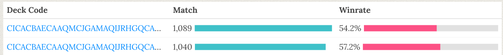

---
params:
  ind: "CI"
  title: "CI?! What is a Confidence Interval?"
  description: "A little guide to understanding and use/read them and why TLC is in the mix?!"
title: | 
  `r params$title`
description: |
  `r params$description`
base_url: https://www.llorr-stats.com
author: Valentino (Legna) Vazzoler
date: 2022-08-03
output:
 distill::distill_article:
    toc: true
    toc_float: true
    toc_depth: 3
    self_contained: false
citation: false
# bibliography: references.bib
draft: FALSE
editor_options: 
  markdown: 
    wrap: 72
---

```{r setup, include=FALSE}
knitr::opts_chunk$set(
  echo       = FALSE,
  eval       = TRUE,
  warning    = FALSE,
  error      = FALSE,
  message    = FALSE,
  comment    = NA,
  R.options  = list(width = 140, digits.secs=6),
  dev.args   = list(bg = 'whitesmoke'),
  fig.align  = 'center',
  fig.width  = 12,
  fig.height = 8,
  # fig.path   = "figures/prefix-"
  fig.path   = glue::glue("images/{params$ind}-"),
  layout     = "l-body",
  preview    = TRUE
)

#' R Option
options(scipen = 999)
source(file.path("C:", "LlorR", "scripts", "lor_main.R"))
# source(file.path("C:", "LlorR", "scripts", "functions", "lor_constants.R"))
# source(file.path("C:", "LlorR", "scripts", "functions", "lor_functions.R"))
xaringanExtra::use_panelset()
```

```{css style settings, echo = FALSE}
blockquote{
    padding: 60px 80px 40px;
    position: relative;
    font-family: "Chivo";
    font-size: 20px;
    font-weight: 700px;
}
```

```{r panelset-style}
xaringanExtra::style_panelset_tabs(
  font_family        = "Helvetica",
  active_foreground  = "white",
  hover_foreground   = "black",
  hover_border_color = "black",
  active_background  = "#007fff"
  )
```

```{r twitter-meta, echo = FALSE}
metathis::meta() |>
  metathis::meta_description(params$description) |>
  metathis::meta_viewport() |>
  metathis::meta_social(
    title = params$title,
    url = "https://www.llorr-stats.com/",
    image = "images/CI-example-wIntersection-1.png",
    image_alt = "CIexample",
    og_type = "website",
    og_author = "Legna",
    twitter_card_type = "summary",
    twitter_creator = "@Maou_Legna"
  )
```

```{r for-reference}
ex_mean  <- 0.55
ex_lower <- 0.525
ex_upper <- 0.575
```

Hi, Legna here, normally I try to write those *analysis articles* in a publication-style format, not meant to be read by everyone; this post on the other hand is meant to be an easier read and accessible to most players.

I would like to say that this is the first of a series of articles meant
to explain some statistical concepts applied in Legends of Runeterra (LoR) or any other cards game, but, I can hardly guarantee it.

Most likely the cadence will be slow. This article alone took weeks to write, not only because I get little time to work on this, but also because of deciding what to writ and how to communicate it.

# Introduction

**Player A**: "This deck is way better than yours. You see, it even
reached a 55% win-rate at Master this week!"

**Player B**: "You fool! You clearly didn't see the latest values as
mine is obviously the superior version with a 55.5% win-rate at Master
this week!"

**Voice in the background**: "Little did they know both decks win-rates
were actually the same"

------------------------------------------------------------------------

For those who use my content one may notice that I use something called
Confidence Interval (CI)


or similarly those who use [Storm](https://twitter.com/storm_lor) [deck
tracker](https://app.lormaster.com/meta) can see he adds a $\pm X$ value
to a deck win-rate.


These $\pm X$ values are again a CI.

Here, we aim to explain what confidence interval are, how they are
computed and why you should almost always require their use.
<!-- and also why/how you shouldn't look too much into them. -->

In order to increase the accessibility of the reading the article is
divided in section of increasing difficulty:

* The first section explains the confidence intervals and what they mean. If you want to make it quick this should be enough.

* The mid section explain how to use a CI and why you should want them. We believe that any 'pro-player' should know the concept from this section.

* The third and last section will add some theory about the CI explaining some of the numbers behind them.

## Before we start

### How to Read/Write a CI

A confidence interval is made of two values called lower limit and upper
limit usually written inside squared or round brackets like

$[lower,upper]$

in addition, it's associated to a probability called **confidence level**.

If the confidence level is not written, it assumed to be 95%

`r kableExtra::text_spec("Example:", color = "blue")` A deck with a 52% mean WR and a 95% confidence interval between 51% and 54% is written

52%; 95% CI [51%,54%]

### the 'TRUE' value

When we refer to the true-value [^1], for example the win-rate of a deck,
we refer to the unknown/actual win-rate that is associated to the deck.
It is the value we try to estimate when we divide
$\frac{\#wins}{\#games}$.

The caveat is that the value we obtain from $\frac{\#wins}{\#games}$ is
an estimation, we don't know how far we are from the actual win-rate
(sort-of).

Unless we truly know the generating process of the phenomenon we are
interested in, we **never** know the true value of what we are
searching for.

For an easier example let's say we flip a coin 10 times. The probability
of head and tails is the same 50% and we will expect a number of head
and tails equal to $0.5\times10 = 5$.

Even so, we know it wouldn't be surprising to ends up with 6 heads / 4 tails obtaining an estimation for head of 60% and tail at 40%. It's
wrong and in this case we know it's wrong because we know the underlying probability of getting head/tail.

With most events we don't have this luxury, we don't know if the decks'
win-rate we can see on various sites is *correct* or biased because of
*reasons*. We can model the win-rates, we can be pretty sure about our
estimations but they always remain estimations.

> Unless we truly know the generating process of the phenomenon we are
> interested in, we **never** know the true value of what we are
> searching for.

Returning to our coin example, increasing the number of coin-flips would
make the estimation more stable, converging after an infinite numbers of
times at the correct/true value of 50%.

Of course we don't really need infinite coin-flips or statistics would
be useless

[^1]: also referred as the population value

# Easy level - A Discursive Explanation

## Super TLDR

> A Confidence Interval gives us information about the variability of our
> results. The smaller the interval is, the better is our estimation. By
> increasing the amount of data the interval gets smaller and smaller.
> While not the correct interpration it could be said that we can expect
> with a certain level of confidence (usually 95%) that the value of
> interest, like the win-rate lies between the lower and upper limit.

`r kableExtra::text_spec("Question:", color = "blue")` If the (95%)
confidence interval or Azir/Irelia ranges from
`r scales::percent(ex_lower,0.1)` and `r scales::percent(ex_upper,0.1)`.
What does this tell us?

`r kableExtra::text_spec("Answer:", color = "blue")` If this confidence
interval is one of the 95% that contains the true win-rate then the true
win-rate of Azir/Irelia lies between `r scales::percent(ex_lower,0.1)`
and `r scales::percent(ex_upper,0.1)`.

<!-- `r kableExtra::text_spec("Answer:", color = "blue")` If this confidence -->

<!-- interval is one of the 95% that contains the true win-rate then the true -->

<!-- win-rate population value of Azir/Irelia lies between -->

<!-- `r scales::percent(ex_lower,0.1)` and `r scales::percent(ex_upper,0.1)`. -->

## What a Confidence Interval is not

While our intuition may tells us how to read a CI, it's also really,
really easy to misunderstand them; so, as counter-intuitive as it may
be, we need to start with what is **not** a confidence interval:

**A Confidence Interval (CI) is not the probability that the true value
of our estimate in inside a certain interval. For such case the true
value is either contained or not and so the probability is either 1
(it's inside) or 0 (it's outside)**

Let's say we have a deck with a `r scales::percent(ex_mean,0.1)` WR and a 95% CI of
[`r scales::percent(ex_lower,0.1)`,`r scales::percent(ex_upper,0.1)`]. A
CI doesn't mean that there is 95% probability that the true win-rate lies between `r scales::percent(ex_lower,0.1)` and
`r scales::percent(ex_upper,0.1)`. If the *true win-rate* is 54%, then the
value is inside the interval and so the probability of being inside it
is 100%. If the true value was 58% then the probability of the true
value being inside the CI is 0%.

`r kableExtra::text_spec("Important:", color = "red")` While the
definition we provided is wrong, for those who are not working with data
it's sort of an *ok definition* to remember, or well, we take those.

`r kableExtra::text_spec("Even worse definition:", color = "red")` The CI corresponding to a deck's win-rate do not represent the interval obtained from the win-rate of the worst and best players. The definition is absolutely independent from specific players and/or their skills.

## What a Confidence Interval is

What a CI is, is an *extension* of a single point estimation (a single
value). By associating a level of confidence, a CI provides a degree of
precision of of our estimate, like the win-rates.

The bigger the range of the CI the less accurate is our estimation.

---

As a simplification: assume we were to take 100 sites that collect
Legends of Runeterra (LoR) data from the API, but because there is an issue with the data collection, each site can only collect a small number of games for each deck.

If we compute the 95% confidence interval from each site we can expect that 95 of the 100 sites have an interval that does contain the true
win-rate.

For a visual explanation of the concept please refer to the example at the start of the third section (Fig.\@ref(sample-CI)).

# Mid Level - Reject Points, embrace Intervals

This section will go a bit more in-depth into the use of CI while still refraining to use many formulae.

## Stretch the Interval

We shall take a little detour to expand the relationship between the
data at our disposal and the confidence level.

As we briefly mentioned in the previous section, we want the CI to be as
small as possible, while still being relevant.

Assuming we are dealing with the same kind of data, like using always
the same deck, there are two values that can influence the range of a
CI:

#### Changing the Confidence Level

the probability by which we want our CI to contain the population
value, our win-rates. at fixed number of data (n), the higher the
confidence level the bigger the confidence interval

**confidence level (**$\uparrow$) $\rightarrow$ range of confidence
interval ($\uparrow$)

As we want that most of our CI may be the ones that do contain the true
value, we want to have the confidence level to be high enough that we
don't have to worry too much about it.

The most common values of confidence level used are 90%, 95% and 99%,
with 95% being the most common of the three.

What follows is a table showing the wideness of the CI at a fixed amount
of data (Tab:\@ref(tab:fixed-n)). Let us also remember, the smaller the
CI is (expressed as wideness in the table) the better is our estimation.

```{r fixed-n}
n  <- 1000
x  <- 550
p  <- x/n

conf_level = c(.5,.75,.90,.95,.99)

map_dfr(conf_level,~binom::binom.confint(n = n,x = x,conf.level = .x,methods = "asymptotic")) |>
  mutate(wideness = upper-lower) |>
  add_column(conf_level = conf_level) |>
  select(-method) |>
  gt() |>
  fmt_percent(columns = c(mean:upper,conf_level),decimals = 1) |>
  cols_label(
    conf_level = md("Conf. Level")
  ) |>
  tab_header(
    title = "CI Variation at different values of conf.level and fixed n"
  ) |>
  fmt_number(wideness,decimals = 3) |>
  gtExtras::gt_theme_espn()
```

<caption>

(#tab:fixed-n)Fixed n table

</caption>

The more *confident* we want to be regarding our results the wider is
the range of the CI, ranging in this case from a min of around 2% (0.021) with
50% confidence to a max of 8% (0.081) range with a 99% confidence.

#### Changing Sample Size

The amount of data at our disposal, for example the number of games of
certain deck for which we wants to estimate the win-rate. at fixed
confidence level, the higher n, the smaller the confidence
interval

**n (**$\uparrow$) $\rightarrow$ range of confidence interval
($\downarrow$)

It is suggested to have $n \ge 30$ and $n \times \hat{p} \ge 5$ with
$\hat{p} = \frac{\#wins}{\#games}$

Now that the relationships are defined, we want to show the effect of
our choices on the results.

Similarly the previous table, here is an example with fixed confidence
level an varying n:

```{r fixed-conf}
n  <- c(10^2, 500, 10^3, 10^4, 10^5)
x  <- .55*n

conf_level = .95

map2_dfr(.x = x,.y = n,~binom::binom.confint(n = .y,x = .x,conf.level = conf_level,methods = "asymptotic")) |>
  mutate(wideness = upper-lower) |>
  add_column(conf_level = conf_level) |>
  select(-method) |>
  gt() |>
  fmt_percent(columns = c(mean:upper,conf_level),decimals = 1) |>
  cols_label(
    conf_level = md("Conf. Level")
  ) |>
  tab_header(
    title = "CI Variation at different values of n and fixed conf.level"
  ) |>
  fmt_number(wideness,decimals = 3) |>
  gtExtras::gt_theme_espn()
```

<caption>

(#tab:fixed-conf)Fixed Conf.Level table

</caption>

Compared to the results in Tab:\@ref(tab:fixed-n), in
Tab:\@ref(tab:fixed-conf) at fixed conf.level, the number of data/games
is even more effective in influencing the CI range and the more data we
have the better. Yet, it's also possible to notice that we have to
increase ten fold the amount of data at our disposal to reduce the
CI range to around 1/3rd of its previous value. [^2]

[^2]: careful that this relationship depends on the win-rate and
    confidence level, so it's not a golden-rule, more on this in the
    next session

### Comparing Win Rates - Overlapping lines

Finally we introduce what is most likely the easiest and
most important use of CI: **hypothesis testing**.

Thanks to the CI it is really easy to answer the question:

-   Are two decks win-rates significantly different?

And the similar question:

-   Does a deck have a positive/negative win-rate?

Now, let us use the example from the introduction.

We have two decks, one with a win-rate of 55.5% and one with a win-rate of
55%. How can we say with confidence that their true WRs do indeed differ?

```{r example-wIntersection, fig.cap="example-wIntersection", fig.width=6, fig.height=4}
n_intro <- 10^4

intro_example <- rbind(
binom::binom.confint(x = 5500, n = n_intro, conf.level = 0.95, methods = "asymptotic"),
binom::binom.confint(x = 5550, n = n_intro, conf.level = 0.95, methods = "asymptotic")
)

intro_example |>
  add_column(deck = c("deckA","deckB")) |>
  mutate(deck = factor(deck, levels = c("deckB","deckA"),ordered = T) ) |>
  as_tibble() |>
  ggplot(aes(x = lower, y = deck, xend = upper, yend = deck, colour = deck)) +
  geom_segment(size=1) +
  geom_vline(aes(xintercept  = lower[2]), linetype = 2, alpha = 0.5, size=1.5 ) +
  geom_vline(aes(xintercept  = upper[1]), linetype = 2, alpha = 0.5, size=1.5 ) +
  scale_x_continuous(labels = scales::percent_format(accuracy = 1) ) +
  labs(
    x = element_blank(),
    y = element_blank()
  ) +
  theme_539() +
  scale_colour_hue("clarity") +
  theme(legend.position = "none")
```

We simply look at their CI and check if the intervals do overlap or not.
If they overlap, like in this case, their difference is not
statistically significant.

In Fig:\@ref(fig:example-wIntersection) the line overlap $\rightarrow$
we don't reject the equality of win-rates $\rightarrow$ there is
**support** for the **equality of win-rates**.

> It's very important to be careful how to interpret a statistical
> hypothesis. One **NEVER PROVES** something, but it can reject an
> hypothesis, giving at most *support* to the opposite but never proving
> it. Think of SCP-55, all that is known is that it is not round, but what
> shape it could have is still an infinite amount of alternative
> options

```{r example-woIntersection, fig.cap="example-woIntersection", fig.width=6, fig.height=4}
tibble(
  deck = c("deckA","deckB"), 
  lower = c(0.52, 0.545),
  upper = c(0.54, 0.58)
  ) |>
  mutate(deck = factor(deck, levels = c("deckB","deckA"),ordered = T) ) |>
  ggplot(aes(x = lower, y = deck, xend = upper, yend = deck, colour = deck)) +
  geom_segment(size=1) +
  geom_vline(aes(xintercept  = lower[2]), linetype = 2, alpha = 0.5, size=1.5 ) +
  geom_vline(aes(xintercept  = upper[1]), linetype = 2, alpha = 0.5, size=1.5 ) +
  scale_x_continuous(labels = scales::percent_format(accuracy = 1) ) +
  labs(
    x = element_blank(),
    y = element_blank()
  ) +
  theme_539() +
  scale_colour_hue("clarity") +
  theme(legend.position = "none")
```

We proceed in the same way for the example illustrated in
Fig:\@ref(fig:example-woIntersection)

The line don't overlap $\rightarrow$ we reject the equality of win-rates
$\rightarrow$ there is support for the **inequality of win-rates**.

So everything seems pretty easy: lines overlap = no difference, no
overlap = different enough...

... well, sort of, unless you are working on a very important model you
don't want to be as strict and try to consider each case

```{r example-fringe, fig.cap="example-fringe", fig.width=6, fig.height=4}
wr_1 = 0.54
n_1 = 250
wr_2 = 0.63
n_2 = 1000

CI_1 <- binom::binom.confint(x = round(wr_1*n_1),n =  n_1, 0.95, methods = "exact")[4:6]
CI_2 <- binom::binom.confint(x = round(wr_2*n_2),n =  n_2, 0.95, methods = "exact")[4:6]

tibble(
  deck = c("deckA","deckB"), 
  lower = c(CI_1$lower, CI_2$lower),
  upper = c(CI_1$upper, CI_2$upper)
  ) |>
  mutate(deck = factor(deck, levels = c("deckB","deckA"),ordered = T) ) |>
  ggplot(aes(x = lower, y = deck, xend = upper, yend = deck, colour = deck)) +
  geom_segment(size=1) +
  geom_vline(aes(xintercept  = lower[2]), linetype = 2, alpha = 0.5, size=1.5 ) +
  geom_vline(aes(xintercept  = upper[1]), linetype = 2, alpha = 0.5, size=1.5 ) +
  scale_x_continuous(labels = scales::percent_format(accuracy = 1) ) +
  labs(
    x = element_blank(),
    y = element_blank()
  ) +
  theme_539() +
  scale_colour_hue("clarity") +
  theme(legend.position = "none")
```

In Fig:\@ref(fig:example-fringe) the two lines overlap but personally we
thinks it would reject the equality of win-rates. It happens for a very
small section and maybe the sample size is not even that big for deckA.
[^3]

With this we don't want to say that sometimes there are no rules about
what to conclude, just that sometimes, it's important to be flexible,
everything is not black and white and to truly understand the data one
must learn to navigate in the infinite sea of greys.

---

Does this mean that we conclude that one must decide subjectively
each time? No! Once we set some rules we should try to follow them as much
as we can but we should always consider what is the implication of the
choices we make.

To better explain what we means, we conclude this section with an example taken from a discussion with [Leer](https://twitter.com/leer97):



We have two versions of Aphelios Viktor whose decklist differ from a
single card and nothing else, the first one has Vi, the second one
has Starshaping.

Based on their WR, the two decks do seem to differ quite a lot, but let's look at the CI

```{r example-leer, fig.cap="example-leer", fig.width=6, fig.height=4}
CI_1 <- binom::binom.confint(x = 590,n =  1089, 0.95, methods = "exact")[4:6]
CI_2 <- binom::binom.confint(x = 595,n =  1040, 0.95, methods = "exact")[4:6]

leer_label <- c("deck-w/Vi","deck-w/Starshaping")

tibble(
  deck = leer_label, 
  lower = c(CI_1$lower, CI_2$lower),
  upper = c(CI_1$upper, CI_2$upper)
  ) |>
  mutate(deck = factor(deck, levels = leer_label,ordered = T) ) |>
  ggplot(aes(x = lower, y = deck, xend = upper, yend = deck, colour = deck)) +
  geom_segment(size=1) +
  geom_vline(aes(xintercept  = lower[2]), linetype = 2, alpha = 0.5, size=1.5 ) +
  geom_vline(aes(xintercept  = upper[1]), linetype = 2, alpha = 0.5, size=1.5 ) +
  scale_x_continuous(labels = scales::percent_format(accuracy = 1) ) +
  labs(
    x = element_blank(),
    y = element_blank()
  ) +
  theme_539() +
  scale_colour_hue("clarity") +
  theme(legend.position = "none")
```

By looking at Fig:\@ref(fig:example-leer) The two deck doesn't seems to
differ as much anymore.

One may say: "But the WR difference is even even 3 percentage points!"

This is true, but let's look at the data in another way:

```{r}
tribble(
  ~A, ~B, ~C,
  "#wins",  595,  590,
  "#games", 1040, 1089
) |> 
  gt() |>
  cols_label(
    A = md(""),
    B = leer_label[1],
    C = leer_label[2]
  )
```

The difference is of 5 additional wins with 50 less games which is not that far-fetched in over 1000 games. Again (Fig.\@ref(sample-CI)) perfectly shows how much the simple effect of chance can be enought to explain those results.

In addition, even assuming the chance wasn't the true factor there could be so much more as a potential explanation. Assume that the Vi version is played usually by more skilled players, that alone could easily explain the difference, before even adding potential factors like luck of match-ups and similar point let us ask the following question:

* Vi is a 5-cost single-copy card, should we really assume that the differences in win-rate can be fully explained by that single difference? If it was a full set of lower-cost cards, then the assumption could be worth considering but this case seems like pushing the limit.

All this is to say: be careful not to see differences everywhere just because some decks differ by a couple of percentage points. Sometimes it could just be that are focusing too much on small differences/details that nothing seems the equal. At the same time, as mentioned before don't focus too much on the defined rules either, and be aware of possible differences that are not yet clearly defined just by a lack of data.

Of course this is only our educated guess, the impact of a single copy(ies) of cards is something we prefer to refrain from doing and leave it to figures like [Dr.Lor](https://twitter.com/drlor4)

<!-- As an example: Assume from the example that deckA is the win-rate of deck without a certain card X while deckB is the win-rate of the same deck but also a certain card X. Saying the two win-rates are the same would mean that that card has no benefits and as we mentioned, this doesn't seems to be the case. So it's better to break the rule and say "There is indeed a difference that should be explained by the included of card X" -->

[^3]: deckA has 250 games, while deckB has 1000 games

## Are you winning son? On positive/negative win-rates

While the comparison of decks' CIs against each other can help us
discern significant differences, this is hardly what we would normally suggest doing with them.

We explained how the CI can help us answer whether or not our deck can
support a certain hypothesis. But instead of asking if it's at a
certain win-rate or if it differs enough from another deck there is
another very basic question that someone would want to know: is my deck
actually good? Or to put it differently: does my deck have a positive
win-rate?

```{r example-middle, fig.cap="example-4", fig.width=6, fig.height=4}
tibble(
  deck = c("deckA","deckB"), 
  lower = c(0.48, 0.52),
  upper = c(0.51, 0.53)
  ) |>
  mutate(deck = factor(deck, levels = c("deckB","deckA"),ordered = T) ) |>
  ggplot(aes(x = lower, y = deck, xend = upper, yend = deck, colour = deck)) +
  geom_segment(size=1) +
  geom_vline(aes(xintercept  = 0.5), colour="black", linetype = 2, alpha = 0.5, size = 1.5 ) +
  scale_x_continuous(labels = scales::percent_format(accuracy = 1) ) +
  labs(
    x = element_blank(),
    y = element_blank()
  ) +
  theme_539() +
  scale_colour_hue("clarity") +
  theme(legend.position = "none")
```

The rules examples in Fig:\@ref(fig:example-middle) doesn't differ from
what we previously told and so:

-   deckB confidence interval is all above the 50% win-rate
    $\rightarrow$ we support the hypothesis that the win-rate is indeed
    positive

-   deckA confidence interval includes the 50% win-rate $\rightarrow$ we
    can't determine if the win-rate is positive or negative.

If we are only interested in knowing if a deck has positive/negative
win-rate or note, as the key point is having the CI including the 50%
value or not there are two consequences to remember:

-   Even if we have few games, if the true win-rate is high or low
    enough we don't need that many games to say if a deck is good/bad.

Looking back at Tab:\@ref(tab:fixed-conf), around 500 games should suffice for
a deck with 55% win-rate. But that number decreases as the win-rate
increases requiring just 100 games if the win-rate was 60%

```{r}
binom::binom.confint(n = 100,x = 60,conf.level = 0.95,methods = "asymptotic")[4:6] |>
  mutate(across(everything(),~scales::percent(.,accuracy = 0.1))) |> 
  kable()
```

-   If we have a win-rate very close to 50%, it's pretty much impossible
    to discern the direction of the win-rate. Even worse
    considering we know we should account for factors like skill.

This result was to be expected, after-all; assume the true win-rate lies
exactly at 50%. Then; not even an infinite amount of games should be able to
provide us a definitive answer.


## To Recap

Confidence intervals are a really easy instrument for comparison of the
win-rate (statistics) we are using. To hyper-simplify: compare the
interval from the CI with what we are interested in, if there is no
overlap there is a statistically significant difference, when
overlapping the difference is not significant.

In the next section we will expand on some of the concepts explained up
until now and some more but with one crucial difference: math will now
start to appear, the countdown was completed with no Promising
Future(?).

# Hard Level - The realm of TLC

In this section we are going to expand on the concepts we only briefly
mentioned before and expand on the theory behind the CI explaining some
of the results.

## Beyond Good and Evil CI

In the discursive section we mentioned that

> If we compute the 95% confidence interval from each site we can expect
> that 95 of the 100 sites have an interval that do contain the true
> win-rate.

What does this actually means? Let's visually recreate the example visually.

Assume we have 100 players who are all equally skilled, all playing the same
deck that we know has a 55% true win-rate. Each player plays 200 games.

Now, for each player we compute the CI and plot each interval
vertically, the result can be seen in Fig.\@ref(sample-CI).

```{r sample-CI, fig.width=12, fig.height=8, layout="l-screen", fig.cap="simulation of 100 samples of their own CI"}
set.seed(7998)
z_95 <- qnorm(0.975)
z_99 <- qnorm(0.995)

p = .55
n = 200

tibble(
  sample = lapply(1:100, function(x) rbernoulli(n = n,p = p) |> as.numeric() ),
  mu     = map_dbl(sample, ~mean(.x)  ),
  sd     = map_dbl(sample, ~sd(.x)    ),
  n      = map_dbl(sample, ~length(.x)),
  lower  = mu - z_95 * sd/ sqrt(n),
  # lower  = map_dbl(sample, ~{ mean(.x) - z_95 * (sd(.x) / sqrt(length(.x)) ) } ),
  upper  = mu + z_95 * sd/ sqrt(n)
) |>
  mutate(capture_mu = ifelse(lower < p & upper > p, "yes", "no")) |>
  rowid_to_column() -> ci_example

ci_example |>
  ggplot() +
  geom_segment(aes(x = lower, y = rowid, xend = upper, yend = rowid, group = rowid, color = capture_mu)) +
  geom_point(aes(x = lower, y = rowid, color = capture_mu), size = 1) +
  geom_point(aes(x = upper, y = rowid, color = capture_mu), size = 1) +
  geom_point(aes(x = mu, y = rowid), size = .75) +
  geom_vline(xintercept = p, color = "darkgray") +
  theme_publication() +
  scale_x_continuous(
    breaks = seq(0,1,0.05),
    labels = scales::percent_format(accuracy = 1)
  ) +
  labs(
    title = "Simulation of CI 100 from 100 samples",
    x = "Win Rate",
    y = element_blank()
  ) +
  theme(
    legend.position = "none",
    axis.title.y = element_blank(),
    axis.line.y = element_blank()
  )

neg_winrate <- ci_example |>
  filter(mu < 0.50) |>
  NROW()
```

Each bar is a CI from a player that either contains (blue) the true
win-rate (55%) or does not contain it (red).

Of the 100 players we notice that we have six intervals that don't
include 55% and so there are 94 that do contain the 55% win-rate. This
is a result by chance but if we repeated this process for an infinite
amount of players we would expect a ratio of 5:95.

As the black dot represent the win-rate for each player we notice that
can differ a lot from the expected value. Not only that, sometimes it's
so low that even as a deck with a true WR of 55%, it would pass a hypothesis test for being a deck with a true WR of below than 50%. This is only due to the effect of pure chance, no
accounting for skill or MU or anything else.

This is a prime example of why *personal results* shouldn't be relied on too much and it's usually better to just use aggregated results.
Using personal results could also bring additional issues but that
could be an entire article by itself. For now and with this example, we hope
it's clearer when we mention "assume the CI is one that contains
the true value" and about how chance can really make an impact.

## Confidence Interval

### Definition and Approximations...

In the mid-section we showed in Tab:\@ref(tab:fixed-n) and
Tab:\@ref(tab:fixed-conf) an example of the effect on the CI range
with different values of sample size (number of games) and confidence
level. To better explain the effect we must show the math behind them, let us start with a general definition of CI:

$P( L \leq \theta \leq U)= 1-\alpha$

where L and U are the lower and upper limits of our interval.

`r kableExtra::text_spec("Note:", color = "blue")`usually the confidence
level is defined as 1 minus the error we want to have, so with an error
of 5% we have a confidence level of 1 - 0.05 = 95%.

The equation above can also be written as:

$CI = [\hat{F}^{-1}_{(1-\alpha)/2},\hat{F}^{-1}_{(1+\alpha)/2}]$

by using the quantile of the statistics we are using.

These equations are hardly clear and for those who didn't do some basic statistics they should not even seems familiar.

Isn't there a simple expression to define how to compute the CI of a win-rate?

This is where we use the reality-warping power of the Central Limit
Theorem [^4], which, given very easy conditions, obliterates any
distribution we needs and replaces it with a very easy Normal
distribution.

Because of that the problem turns into:

$P( -z_{\alpha/2} \leq \frac{p-\mu}{\sigma\sqrt{n}} \leq z_{\alpha/2}) = 1-\alpha$

Where $z_\alpha$ are the quantiles of the level of a Normal distribution.

The previous expression can be further rewritten to obtain the interval defined by

$\mu \pm z_{\alpha/2} \frac{\sigma}{\sqrt(n)}$

and as we are dealing with a proportion $\hat\mu = p = \frac{\#wins}{\#games}$ and $\hat\sigma = \hat{p}(1-\hat{p})$ we obtain:

$p \pm z_{1-\alpha/2} \sqrt{\frac{p(1-p)}{n}}$

After regurgitating all those expressions we are left with a very simple
one, which is even simpler if we consider for a confidence
level of 95% we have $z_{\alpha/2} = 1.96 \sim 2$

$p \pm 2 \sqrt{\frac{{p(1-p)}}{n}}$

While normally we could stop here we complete this section with a little 'hack'. If we want a very quick computation of the CI and if our win-rate is between 30% and 70%, so pretty much all realistic cases, then $\sqrt{p(1-p)}$ doesn't differ too much from when $p=50\%$ and $\sqrt{p(1-p)} = 1/2$ making it so that we could very appropriately obtain

$p \pm \frac{1}{\sqrt{n}}$

Again, this is a very rough approximation which shouldn't be normally used but it can help to obtain a basic idea about how big our CI should be.

[^4]: or Teorema Limite Centrale, TLC in italian

### ...and Curves

Now the relationship we defined as how a CI's range change at varying
the value of confidence level and sample size (n or number of games)
should be clearer.

For reference here are some values of confidence level and the
associated $z_{\alpha/2}$

```{r}
tribble(
  ~conf, ~z,
  0.50, qnorm((1-.50/2)),
  0.95, qnorm((1-.05/2)),
  0.99, qnorm((1-.01/2)),
  0.9999, qnorm((1-.0001/2))
) |>
  gt() |>
  fmt_percent(columns = conf,decimals = 2) |>
  fmt_number(columns = z,n_sigfig = 3) |>
  cols_label(
    conf = md("Conf. Level"),
    z = md("Z")
  ) |>
  gtExtras::gt_theme_espn()

```

The confidence level while impactful is not usually the one that matter
when creating a confidence level. Even more considering it's usually
fixed at 95% so with associated an value of 1.96.

The number of games is what usually can contribute the most to the CI's
range but as the expression shows, it's not by the linear increase of
the number of games but instead by the square root of the number of games.
That is why at some point the range doesn't decrease by much even after
adding so many games.

In Fig.\@ref(plot-range-a) we present a graphical representation of the
CI's range at a fixed confidence level of 95% varying the number of games
and for different win-rates. In Fig.\@ref(plot-range-b) we restrict the
number of games to a smaller, more common range.

```{r create-curves}
win_rates <- c(.55, .70, .85)
games     <- seq(10,250000,10)

tidyr::crossing(win_rates,games) |>
  mutate(
    lower = win_rates - 1.96*sqrt(win_rates*(1-win_rates)/games ),
    upper = win_rates + 1.96*sqrt(win_rates*(1-win_rates)/games ),
    range = upper - lower
  ) |>
  mutate(label = scales::percent(win_rates,accuracy = 0.1) |> as_factor() ) -> range_curves
```

```{r plot-range-a, fig.width=6, fig.height=4, fig.cap="CI range variation - plot a"}
range_curves |>
  ggplot() +
  geom_line(aes(x = games,y = range, group=label, color=label) ) +
  scale_x_continuous(limits = c(0,250000) ) +
  scale_y_continuous(limits = c(0,0.1), labels = scales::percent_format(accuracy = 1)) +
  theme_publication() +
  labs(
    x = "#Games",
    y = "Range",
    title = "Confidence Interval Range",
    subtitle = "Variation at different win rates and number of games",
    color="Win Rate"
  )
```

```{r plot-range-b, fig.width=6, fig.height=4, fig.cap="CI range variation - plot b"}
range_curves |>
  ggplot() +
  geom_line(aes(x = games,y = range, group=label, color=label) ) +
  scale_x_continuous(limits = c(0,2000), breaks = seq(0,2000,200) ) +
  scale_y_continuous(limits = c(0,0.5), labels = scales::percent_format(accuracy = 1)) +
  theme_publication() +
  labs(
    x = "#Games",
    y = "Range",
    title = "Confidence Interval Range",
    subtitle = "Variation at different win rates and number of games",
    color="Win Rate"
  )
```

With the 'hack-approximation' we described above the relationship between the CI's range and the square root of the number of games should be even easier now.

# Conclusion

And so we conclude this explanation of confidence intervals. We hope we
were able to dissipate the mystery about how they work and also
explaine why they are so important.

We hope that other "lor-stats-creators" will one day start using them
too. The tool is very very easy to use and should be fairly easy to
grasp. Some nuances might not be not as easy to implement but the very basics should
help the most competitive players to better evaluate decks and do better
choices.

# Appendix {.appendix}

## Central Limit Theoreom (CLT)

Let $X_1,X_2,...,X_N$ be a set of N independent random variates and each
$X_i$ have an arbitrary probability distribution and
$Y = X_1 + X2 + ...+ X_n$ be the sum of the n i.i.d. random variables
$X_i$.

Let $E(Y) = \mu_Y$ and $Var(Y) = \sigma^2_Y$

The Central Limit Theorem says

$Y \approx N(\mu_y,\sigma^2_Y)$

If the $X_i$ are i.i.d. with mean Let $\mu_X$ and variance $\sigma^2_X$,
then $\mu_Y = n\mu_X$ and $\sigma^2_Y = n\sigma^2_X$

For the sample mean $\bar{X_n}$, the CLT says

$\bar{X_n} = \frac{1}n(X_1+X_2+...+X_n) \approx N(\mu_y,\sigma^2_Y)$

------------------------------------------------------------------------

This theorem states that when samples are large (above about 30) the
sampling distribution will take the shape of a normal distribution
regardless of the shape of the population from which the sample was
drawn. For small samples the t-distribution better approximates the
shape of the sampling distribution.

We also know from this theorem the standard deviation of the sampling
distribution (i.e., th standard error of the sample mean) will be equal
to the standard deviation of the sample (s) divided by the square root
of the sample size (N). The central in the name refers to the theorem
being important and far-reaching and has nothing to do with centres of
distribution. [^5]

`r kableExtra::text_spec("Question:", color = "blue")` Someone may ask:

-   If we can use the CLT for the sample mean. Why can we use it with
    our win rates case? That is a case of a single Binomial
    distribution. Where are the sum of variables?

`r kableExtra::text_spec("Answer:", color = "blue")` The answer lies in
the definition of the Binomial Distribution. The Bimonial distribution
is after all, no more than a sum of Bernulli distribution with same
probability parameter of the event but being repeated n amount of times.
What we obtain as the win rate estimation of $\frac{\#wins}{\#games}$
turns out to the sampling mean of n Bernulli. This is also the reason
why the results of a Binomial distribution are said to approximate to a
Normal distribution after around 30 repetitions $\rightarrow$ we are
using the CLT.

```{r fig.width=12, fig.height=8, layout="l-screen"}
# # require(statsr,quietly = TRUE)
# # parameter
# 
# n <-100
# p = 0.55
# 
# ci_example <- tibble(
#   p = rnorm(n = n,mean = p,sd = p*(1-p))
# )
# 
# param <- ci_example |>
#   summarise(mu = mean(p))
# 
# #
# # ci_example |>
# #   summarise(
# #     lower = mean(p) - z_95 * (sd(p) / sqrt(n)),
# #     upper = mean(p) + z_95 * (sd(p) / sqrt(n))
# #   )
# 
# ci <- ci_example |>
#   statsr::rep_sample_n(size = n, reps = n, replace = TRUE) |>
#   summarise(
#     lower = mean(p) - z_95 * (sd(p) / sqrt(n)),
#     upper = mean(p) + z_95 * (sd(p) / sqrt(n))
#   ) |>
#   mutate(capture_mu = ifelse(lower < param$mu & upper > param$mu, "yes", "no"))
# 
# ci_data <- data.frame(
#   ci_id = c(1:n, 1:n),
#   ci_bounds = c(ci$lower, ci$upper),
#   capture_mu = c(ci$capture_mu, ci$capture_mu)
# )
# 
# ggplot(data = ci_data, aes(x = ci_bounds, y = ci_id, 
#                            group = ci_id, color = capture_mu)) +
#   geom_point(size = 2) +  # add points at the ends, size = 2
#   geom_line() +           # connect with lines
#   geom_vline(xintercept = param$mu, color = "darkgray") + # draw vertical line
#   theme_publication() +
#   scale_x_continuous(
#     labels = scales::percent_format(accuracy = 1)
#   ) +
#   labs(
#     title = "Simulation of 100 samples of 100 CI",
#     x = "Win Rate",
#     y = element_blank()
#   ) +
#   theme(
#     legend.position = "none",
#     axis.title.y = element_blank(),
#     axis.line.y = element_blank()
#   )
```

<!-- ## Andy -->

<!-- We can't access the population so we take samples There will be -->

<!-- variation across samples There will be sampling errors We go crazy for -->

<!-- sampling and we takes lots of sampling and we takes the means for each -->

<!-- samples and plot the distribution of the means the particular sample we -->

<!-- have may not have have the population values but the sampling -->

<!-- distribution will give us the population value the sampling deviation -->

<!-- will give us that the sampling deviation should be narrows and the -->

<!-- standard deviation of the sampling distribution is the standard error -->

<!-- An interval such as that across a large number of samples we contains -->

<!-- the population values How wide should the interval be to contains the -->

<!-- population value a lot of times we take a sample and decide to use it -->

<!-- 1.96\*SE -->

<!-- The estimate and its interval may or may not contain the true population -->

<!-- value across a lot of sample if were to set the limits around the -->

<!-- estimate around 1.96\*SE we are going to hit the population value 95% of -->

<!-- SAMPLES -->

<!-- Each bar is a sample that -->

<!-- Intervals that contains the true population value of the paramter in 95% -->

<!-- ifsamples -->

<!-- NO - It's an interval i'm 95% confident that the population estimate -->

<!-- falls within the interval it's an interval where there is a 95% -->

<!-- probability that contains the population value! Hyper no! it's either 1 -->

<!-- or 0 but you don't know which They do not reflect confidence in the -->

<!-- value of the population parameter -->

<!-- Assuming that this sample is one of the 95% that yields a confidence -->

<!-- interval containing the true value of the parameter -->

<!-- For every standard deviation change of the paramter we have an increase -->

<!-- of the effect -->

<!-- In statistics, a sampling distribution or finite-sample distribution is -->

<!-- the probability distribution of a given random-sample-based statistic -->

<!-- Wikipedia -->

[^5]: Andy Field - An Adventure in Statistics the reality enigma. Second
    Edition

# Credits

Thanks to Leer for helping edit some spelling/grammar errors.
