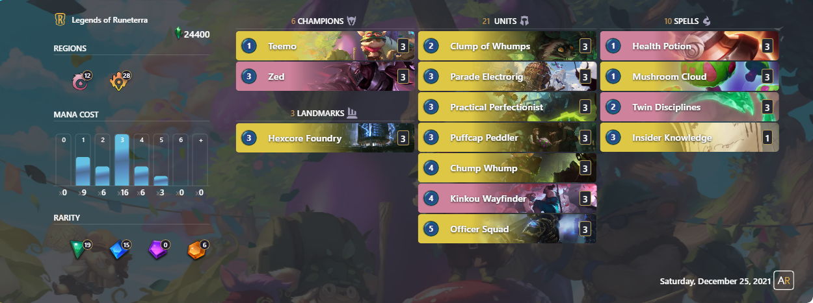

---
params:
  ind: "03"
  title: "Defining Archetypes #3: Approaching a Clustering Analysis with a Season worth of Data"
  description: "Describing the basic issues when using Clustering Analysis with a bigger dataset and a possible solution in the context of Legends of Runeterra decks."
title: | 
  `r params$title`
description: |
  `r params$description`
base_url: https://www.llorr-stats.com
author:
  - name: Valentino (Legna) Vazzoler
date: 12-25-2021
output:
 distill::distill_article:
    toc: true
    toc_float: true
    toc_depth: 3
    self_contained: false
citation: false
slug: legna2021archetype03
draft: FALSE
# bibliography: references.bib
---

```{r setup, include=FALSE}
knitr::opts_chunk$set(
  echo = FALSE,
  eval = TRUE,
  warning = FALSE,
  error   = FALSE,
  message = FALSE,
  comment = NA,
  R.options = list(width = 140,digits.secs=6),
  dev.args  = list(bg = 'transparent'),
  fig.align = 'center',
  fig.width = 12,
  fig.height= 8,
  layout="l-body-outset"
  # preview=FALSE,
  # engine.path = list(python = 'C:/anaconda/')
)

options(scipen = 999)
source(file.path("C:","LlorR","scripts","lor_main.R" ))
source(file.path("C:","LlorR","scripts","functions","lor_constants.R"))
source(file.path("C:","LlorR","scripts","functions","lor_functions.R"))

xaringanExtra::use_panelset()
```

```{r style}
xaringanExtra::style_panelset_tabs(
  font_family = "Helvetica",
  active_foreground = "white",
  hover_foreground = "black",
  hover_border_color = "black",
  active_background = "#007fff")

table_nums  <- captioner::captioner(prefix = "Tab.")
figure_nums <- captioner::captioner(prefix = "Fig.")

f.ref <- function(x) {
  stringr::str_extract(table_nums(x), "[^:]*")
}
```

# Introduction

In the [previous article/analysis](https://llorr-stats.netlify.app/analysis/defining-archetypes-02/) on defining archetypes we introduced the basic theory of Cluster Analysis (CA) and applied to a simple toy-example of Legends of Runeterra (LoR) decks.

We introduced the general theory along side a few widely-used algorithms and some of the "newer" ones like Density-Based Spatial Clustering of Applications with Noise (DBSCAN) and Affinity Propagation Clustering (APcluster).

The example was tailored to give a general idea about the methods, some of their strong point and also potential weaknesses with this specific context of analysing LoR decks.

As the previous analysis was mostly based around the basic approach to the methods and a well defined example it can't translate directly to a generalized use with the commonly analysed data like the weekly reports.

For now, we want to continue to use the Cluster Analysis but this times applied to a set of data on a scale more similar to a *real-case-study*. To do this we first need to solve a couple of issues related to the scale of the algorithms at hand.

```{r load-data}
LoR.Deck.RMD       <- fread(file.path("C:","LlorR","data","raw","LoR_DECK.csv"),na.strings = c("",NA))

fread(file.path("C:","LlorR","data","raw","games","LoR_MatchDT_S10_218_220.csv"), select=c("game_type","deck_code_1","deck_code_2"), header = T, na.strings = c("", NA)) |>
  filter(game_type=="Ranked") |>
  select(-game_type) |>
  pivot_longer(cols = contains("deck_code"),values_to = "deck_code",names_to = NULL) |>
  distinct(deck_code) |>
  as.data.table() -> S10Decks
```

### An Engineering Problem

What are the main issue when switching to data from a real-case study? Mostly the impact of the amount of decks to use with the resulting computational load. Also the *dirtiness* of the data resulting from not having a clean dataset, but that is to be expected.

Distance matrices and consequently all algorithm derived by them have a quadratic growth $O(n^2)$ so scalability is a problem, even more so as this project to "define archetypes" is not meant to be purely theoretical. The aim of this project is to also apply it to the collected data and provide the results, be it in the reports or any other content so time has to be considered.

Yet, creating distance matrices at high dimension is not feasible even assuming the analysis is self contained and we have an infinite amount of time to compute the distances.
Time is not the only factor, *Space* is too and probably it is even more important to find a way to solve it. One may not be used to these context so let us give some numbers of the problem at hand.

At the moment of the writing of this article our Deck's dataset is made of about 1M decks ^[Constructed, SeasonalTournamentLobby, Bo3ChallengeLobby, StandardGauntletLobby, LastCallQualifierGauntletLobby].
The dataset contains only 40-cards decks which has been played in Constructed or PvP modes.

Realistically, we would never try to works with all of them at the same time, at least not when using a cluster analysis (CA).
A more appropriate time-frame can be a single competitive Season and restrict ourselves only to the decks played around that time.

To give a reference of a 'real-case' number, the Between Worlds (S10) Season which lasted from patch 2.18 to 2.20 featured at Master rank ~`r floor(NROW(S10Decks)/1000)*1000` unique decks.

As we are not ready yet to just simply apply any methods to any kind of decks data we are going to create a dataset so that is has a similar scale of the S10-MasterRank (`r floor(NROW(S10Decks)/1000)*1000`) decks.

For this article we planned to create an example made of `r 55*800` decks. The creation criteria will be explained in another moment. Its size is clearly to have an order of magnitude similar to the S10-MasterRank numbers. Se say **planned** as the actual analysis of the dataset is being delayed because of issues we just introduced.

```{r create-example, eval=FALSE, include=FALSE}
set.seed(123)
LoR.Deck.RMD |>
  group_by(factions) |>
  # more than 800 would have trouble for some factions
  slice_sample( n = 800 ) |>
  ungroup() |>
  fwrite("./data/example_archetye_03.csv")

set.seed(123)
Archetype3.20 <- example_archetye_03 |>
  group_by(factions) |>
  slice_sample(n=20) |>
  ungroup()

fwrite(Archetype3.20, "./data/example_archetye_03_20.csv")
cos.dsim.arch3.20  <- cos.dsimMatrix(Archetype3.20$deck_code)
fwrite(as.matrix(cos.dsim.arch3.20),"./data/example_cosDist_03_20.csv")

set.seed(123)
Archetype3.100 <- example_archetye_03 |>
  group_by(factions) |>
  slice_sample(n=100 ) |>
  ungroup()

fwrite(Archetype3.100,"./data/example_archetye_03_100.csv")
cos.dsim.arch3.100 <- cos.dsimMatrix(Archetype3.100$deck_code)
fwrite(as.matrix(cos.dsim.arch3.100),"./data/example_cosDist_03_100.csv")
```

```{r read-example-03}
example_archetye_03 <- data.table::fread("C:/Users/Valentino Vazzoler/Documents/R/llorr-website/data/example_archetye_03.csv",na.strings = c("",NA))
```

```{r read-cos-dsim}
cos.dsim.arch3.20  <- fread("./data/example_cosDist_03_20.csv",header=T)  |> as.matrix() |> as.dist()
cos.dsim.arch3.100 <- fread("./data/example_cosDist_03_100.csv",header=T) |> as.matrix() |> as.dist()
```

Let us now give some more numbers of the problem at hand, let's talk about the memory allocation of the distance matrix:

* If we used only a fraction of the chosen decks, just 1100, then we would have a $1100 \times 1100$ distance matrix that requires: `r format(object.size(cos.dsim.arch3.20), units = "Mb")`

* If we increased the choice to 5500 decks, the resulting 5500x5500 distance matrix would occupy: `r format(object.size(cos.dsim.arch3.100), units = "Mb")`.

Quite the increase but consistent to the fact that the second matrix is 25 times the smaller one and we can see the issue with the quadratic growth that comes with the matrix.

* By using all the 44k decks we can't even try to recreate the distance matrix, it would require a very good machine and we can infer that just the distance matrix size with its $44000^2$ elements would be of around `r 116*(44000^2/5500^2)` Mb. We wouldn't be able to allocate enough memory to save it, let alone work with it.

Overall, while it would be nice to work with any available data (assuming it's meaningful) one can't ignore the time/cost that comes from each choice and so we need to search for a way to circumnavigate the issue. While we don't have the perfect solution, we are going to propose a way to approach the problem making it a bit more feasible.

# Discussion

### Needles in the Shuriman (vast) Desert

Let us assume that we are able to solve the computation and allocation of the distance matrix; this would solve the engineering-side of the problem it would most likely be an incredible 'a waste' of resources.

To explain this we are going to show the resulting heatmaps of a couple of subsets of the example dataset. One with a subset of 1100 decks and another one with 5500 decks. In both cases the subset decks are chosen not completely at random.

The resulting heatamap with 1100 decks is:

```{r Heat1100, fig.width=4, fig.height=4, fig.cap="heatmap of a 1100 x 1100 distance matrix of LoR decks chosen not completely at random"}
lattice::levelplot(as.matrix(cos.dsim.arch3.20), main="1100 X 1100 Heatmap", xlab="", ylab="", col.regions=colorRampPalette(c("yellow","firebrick3"), space = "rgb")(10), cuts=9, at=seq(0,1,0.1), scales=list(x=list(at=NULL),y=list(at=NULL)))
```

The resulting heatamap with 5500 decks is:

```{r Heat5500, fig.width=4, fig.height=4, fig.cap="heatmap of a 5500 x 5500 distance matrix of LoR decks chosen not completely at random"}
lattice::levelplot(as.matrix(cos.dsim.arch3.100), main="5500 X 5500 Heatmap", xlab="", ylab="", col.regions=colorRampPalette(c("yellow","firebrick3"), space = "rgb")(10), cuts=9, at=seq(0,1,0.1), scales=list(x=list(at=NULL),y=list(at=NULL)))
# ,colorkey=NULL

# heatmap3::heatmap3(as.matrix(cos.dsim.arch3.20),useRaster=T,Rowv=NA,Colv=NA, col = colorRampPalette(c("yellow","firebrick3"))(1024))
```

As we can see in Fig:\@ref(fig:Heat1100) and Fig:\@ref(fig:Heat5500) there are clear indication of the presence of several small clusters (the yellow areas) but in the majority, the vast majority of the matrix, the distance is at its max (1) and the similarity is at its min (0) ^[ [0,1] being the domain of the cosine-similarity.].

While we need to account for the decks that compose the example, in a *typical real-case* the results would be similar in most cases.

There is a structural reason behind this and that's a result of the limitation imposed by the deck building process which doesn't allow the use of cards from more than two different regions (not counting Dual Region cards). This makes almost all pair of decks decks with no common region having a similarity that has to be zero (again, dual region cards aside).

Our proposed solution is to use this information and start simplify the problem to a series of smaller one cases.

Because of the limitation in deck building we know that the similarity of decks with no common faction has to be zero. A Noxus-PnZ deck has to have a similarity equal to zero with a ShadowIsles-Shurima deck and if we order the deck by faction it means that the distance matrix is made of several $0_{n \times n}$ sub null-matrix.

To be more precise, there are sadly exception to this property: when we deal with dual region cards we can have non overlapping factions but still common cards ^[BandleCity Ruined more than the Ruination].

> Example: a BandleCity/Noxus (BC/NX) deck and a Demacia/Ionia (DE/IO) deck both sharing "Poppy" as a card. Both their regions are different but the similarity if not null is we are going to use the original card code of a card.

For now everything we will do will ignore the dual-region issue and leave it for for future works.

### The Lazy Approach

Let's assume we don't have the problem of the Dual-Region cards and all the 10 regions, what do we know about the structure of the similarity matrix?

We know that there are 55 unique combination of region and so when comparing two decks it can fall into one of $55^2$ possible confrontation. Of course as we know that the Matrix is symmetrical it's reduced to just `r 55*56/2` cases.

Of these `r 55*56/2` cases, as we already explained, most of them are made of null-matrix. But how many exactly?

As we mentioned only when there is at least a common region the similarity can be different from zero. This makes it so the number of sub-matrix to consider follows the following formula:

$$
\sum_i^n((i-1)^2+\frac{i(i+1)}{2})
$$

```{r}
tab.1_cap <- table_nums(name = "tab_1", caption = "Percent of sub-matrix that share a common region by amount of by number of existing regions.")
```

The following table shows the percentage of sub-matrix that can be not-null depending on the number of existing regions:

```{r table-sparse, fig.cap="tab_1"}
#' region to find the percentage all cases of "interceptions" between elements like factions. For example BC/NX does correlate with all BC and all NX cases
regionComboInterception <- function(n) {
  # n = 10
  dim <- n*(n+1)/2
  total = 0
  for ( i in 1:n ) {
    p1 <- i*(i+1)/2
    p2 <- (i-1)^2
    total <- total + p1 + p2
  }
  total/(dim*(dim+1)/2)
}
  
tibble::tibble(
  region = 1:10,
  coverage = map_dbl(1:10, ~regionComboInterception(.x)) ) -> regionSparsity

regionSparsity |>
  gt::gt() |>
  fmt_percent(
    columns = coverage,
    decimals = 2
  ) |>
  tab_header(
    title = "Sparsity of Similarity Matrix",
    subtitle = md("Percent of sub-matrix that share a common region <br> by number of existing regions.")
  ) |>
  gtExtras::gt_theme_538() |>
  tab_options( table.background.color = "whitesmoke",
               column_labels.background.color = "whitesmoke" )
```

`r table_nums('tab_1')`

From `r f.ref("tab_1")` we can see that in the current setting with n=10 existing regions, of the `r 55*56/2` cases only the `r scales::percent(pull(regionSparsity[10,2]),accuracy = 0.1)` of pairing of combination of regions is actually meaningful with a similarity that can different from zero.

But this is not over as again only a small subset of this `r scales::percent(pull(regionSparsity[10,2]),accuracy = 0.1)` is actually relevant.

When we compare decks with a single shared region not all comparison are meaningful and what follows is a simplification which works for most cases.

If pairs of decks shares only one regions, for the similarity not to be zero that very same region needs to contains all the common cards. Usually it means that the shared cards are key component to a strategy and unless they are mainly staples they would probably identify an archetype. In the most extreme case the shared region presence may be overwhelming compared to the second one which is used only for the second region unique strength offered by some cards. Like the Rally effects from Demacia.

In other words, when comparing pair of decks with a single shared region, since we aim to look for clusters, the decks that matters are the "bridge" among the regions with a main region that mostly identify the deck.

As easy example is the Mistwraith decks that we also used in the previous article.

Normally Mistwraith decks are made mostly of Shadow Isles cards while the remaining cards are often from a region of choice that synergies with the rest of the deck but are not essential / key-cards. This cards act are the bridge between regions.

Is the deck using as the only not-SI cards 3 copies of Pale Cascade? Then it's a SI/MT deck

Is the deck using as the only not-SI cards any copies of Raz Bloodmane? Then it's a SI/SH deck and SI/MT and SI/SH are connected

Is the deck using as the only not-SI cards 3 copies of Iterative Improvement? Then it's a SI/PZ deck and we connected SH,MT and PZ by SI.

And so on with all the non-SI regions.

Of course as mentioned this is more an approximation as one could that a Mistwraith deck with just 20 SI cards and a lot of duplication cards, the deck could still be defined as Mistwraith decks; here we are going to assume that such identification is an over-simplification and it's more likely it would be better to define that '20 SI cards Mistwraith deck' as a sub-archetype of Mistwraith Allegiance. While the main archetype and the sub-archetype would have a similar strategy, we believe it would have a play-pattern that differs enough from the 'main Mistwraith Allegiance' as the amount of cards from the second region would have a greater impact.

In a second step, when trying to find more generalized archetypes (be it something like aggro/control/initiative/resource) then there is reason to try aggregated these different 'aggregated version' of Mistwraith decks but as of now, with

Addendum: At the moment of the writing the Ionia-Allegiance decks provides an even more easier example as similar to Mistwraith decks they are often made of only Ionia cards and differ mostly by the choice of the second region.

### Cross-Region Comparisons

When confronting decks with only a shared region we explained how we consider more appropriate to only use *bridge decks* and considering all the other cases as with null similarity. This open for question: how do we define these bridge decks? Intuitively we described how they mainly relates to cases where a region has an overwhelming playrate compared to the second one, or to put it on another term they are almost mono-region decks.

If so, at which point a deck can be considered almost mono-region? What benchmark and rules should we use?

This is tricky but our idea is to use both an hard defined benchmark and the presence of Allegiance cards.

The choice to include **the use of Allegiance cards** is meant to be a clear and easy to understand rule that at the same times allows for a more "fuzzy separation" of \~Mono decks with the not-mono decks. The allegiance rule should be able to include some decks that may still point toward a certain strategy that is connected to the region identity while not investing as much cards from that region.

As such, one question may arise: doesn't the presence of Allegiance cards requires already a massive amount of cards in a deck from the same region of the allegiance card? It does. But it's not an hard requirement. Also one shouldn't underestimate the wild deckbuilding that can be found even at high level ranks, even if few, it's possible to find all kind of wild decks. We are going to now provide a couple of characteristics of the presence of Allegiance cards in the "Between Worlds Master rank" decks.

```{r allegiance-dataset}
S10Decks |>
  left_join(LoR.Deck.RMD, by = "deck_code") |>
  mutate(cards.region = ifelse(!is.na(cards.region.fix), cards.region.fix, cards.region ) )  |>
  filter(!is.na(allegiance)) |>
  mutate(
    alle = map(allegiance, ~str_split(.x,pattern = ",")[[1]] ),
    alle = map(alle,unique),
    alle = map_chr(alle,~str_flatten(.x,collapse = ",")),
    alle.region = str_sub(alle,3,4)
  ) -> AlleDT
```

```{r}
tab.2_cap <- table_nums(name = "tab_2", caption = "Frequency table of all combination of card and copies of Allegiance cards played in the S10 at Master rank.")
```

```{r table-alle-card, fig.cap="tab_2"}
AlleDT |>
  tabyl(allegiance) |>
  rmarkdown::paged_table( options = list(rows.print = 10) )
```

`r table_nums('tab_2')`

First and foremost with `r f.ref("tab_2")` we can see that simply assuming Allegiance cards identify the main region of a deck is not completely fail-proof as they may exist decks that use Allegiance cards from both regions of a deck. Of course they are extreme cases, they are exception to the rule but as they exist they needs to be accounted for. For now we will simply remove these cases if encountered.

For the **amount of cards from the same region** we propose to use all decks with no less than 32 cards from the same region (80%+ cards from the same region). This choice is mostly a guided personal choice than a data-driven one even if we will be able to see that data sort of confirm the validity of choice.

The reason behind the choice is a such when creating an Allegiance deck that wants to use an Allegiance card deck one can push a second risk with the risk at the main region not being as consistent as it could:

* Using 3 cards from the second region minimize the risk of failing Allegiance while maximizing the use a very strong card from the second region.

* Most players would agree that without card draw control, more than 10 cards from the second region (25%+) is pushing luck.

* Of all the other cases in the middle having 8 cards from the second region (20% of the total) is probably the most one may push with the risk-benefit.

The following table shows the relationship of Decks with Allegiance cards with the amount of cards from the same region of the Allegiance card.

```{r}
tab.3_cap <- table_nums(name = "tab_3", caption = "Cumulative Frequencies of Allegiance decks by decreasing amount of cards from the same region of the Allegiance card.")
```

```{r table-alle-freq}
AlleDT |>
  separate_rows(cards.region,cards.region.freq, sep = ",",convert = T ) |>
  select(alle,alle.region,cards.region,cards.region.freq) |>
  filter(alle.region==cards.region) |>
  rename(cards.region.num=cards.region.freq) |>
  filter(!str_detect(alle,",")) |>
  as_tibble() |>
  tabyl(cards.region.num) |>
  rename_with(~c("cards","n","cumfreq")) |>
  arrange(desc(cards)) |>
  mutate(cumfreq=cumsum(cumfreq)) |>
  gt::gt() |>
  tab_header(
    title = "Cumulative Frequencies of Allegiance Decks",
    subtitle = md("Percentages by decreasing amount of cards from the same region of the Allegiance card.")
  ) |>
  cols_label(
    cards  = md("same region cards"),
    cumfreq = md("cumulative frequency")
  ) |>
  fmt_percent( columns = 3, decimals = 2 ) |>
  gtExtras::gt_theme_538() |>
  tab_options( table.background.color = "whitesmoke",
               column_labels.background.color = "whitesmoke" ) |>
  tab_source_note( source_note = glue::glue("Values from the example dataset created for this article. The dataset is made of 800 random decks for each of the 55 combinations of regions among the decks collected over time.") )
  
```

`r table_nums('tab_3')`

From `r f.ref("tab_3")` we can see that in this example 32 cards is the benchmark which allows to include 95% of the Allegiance decks and we are satisfied by this.

The most surprising result is the presence of decks that have a very few amount of cards from the same region of the Allegiance card like the following example



The above deck is an example of those decks. While strange we can still see that it's supposed to be a different take from the Teemo-Ionia decks that are usually played. Would this case be more appropriate to be considered noise for that archetype? Maybe but at the same time we can also assume it's an archetype of its own. Overall this is problem related to what defines an archetype. This topic will be explored in the next article as we are trying to apply this approach to the example dataset, or to be more correct, to two of the 55 possible subsets of the example dataset, one for a MonoRegion case and one for a generic dual-region case.

# Conclusion

Overall this was a very simple article of the subject but that is key to the archetype problem. Again and again I usually start with an idea I have in mind for what should follow an article I just released and each time while in the process of doing it I find myself having to deal with many different issue that needs to be solved before going forward. In this case I wanted to simply apply the cluster algorithms from the second article to the example dataset created here and had to deal with the resources problem (well that one was expected actually) and having to define the rules which allows for the overall data to be divided. At the same time I already saw some of the problem regarding the application of the CA to a bigger dataset regarding the clusters that are being found. As I only partially anticipated something that the next article will have to deal with is to "define what defines an archetype" which is related to the Theseus Ship dilemma. When does an archetype stops being the same archetype after changing one card at a time? Here I won't promise I will find a personal answer to the problem but again at least something that will allows me to provide some results for the two sub-examples I'm planning to tackle. Will it actually be what the next article will accomplish? Hard to say, but at least that's the new visible goal.