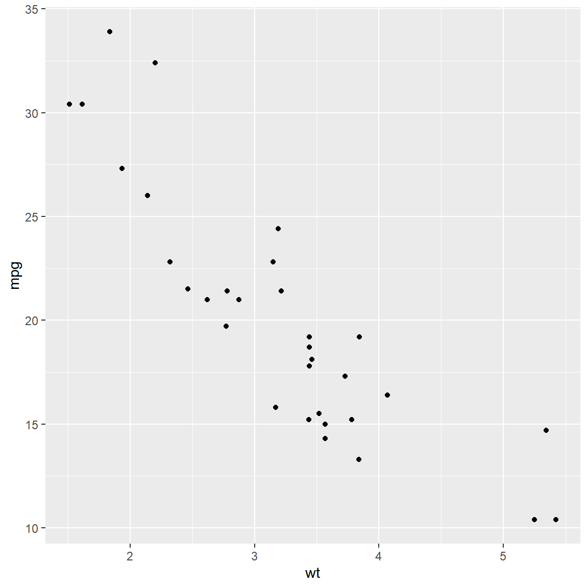

```{r setup}
knitr::opts_chunk$set(
  fig.width = 12,
  fig.height = 8,
  fig.path = "images/MR40-"
)
```




```{r}
#| fig.path = "images/"
# knitr::include_graphics(path = file.path("images","MR40-region-freq-1.png"))


```

```{r region-freq}
#| echo = FALSE,
#| message = FALSE,
#| fig.width = 6, fig.height = 6,
#| fig.caption = "This is a long caption that fits better inside of a code chunk",
#| fig.alt = "This is a long description that conveys the meaning of the visual."

ggplot2::ggplot(data = mtcars, ggplot2::aes(x = wt, y = mpg)) +
  ggplot2::geom_point()
```
