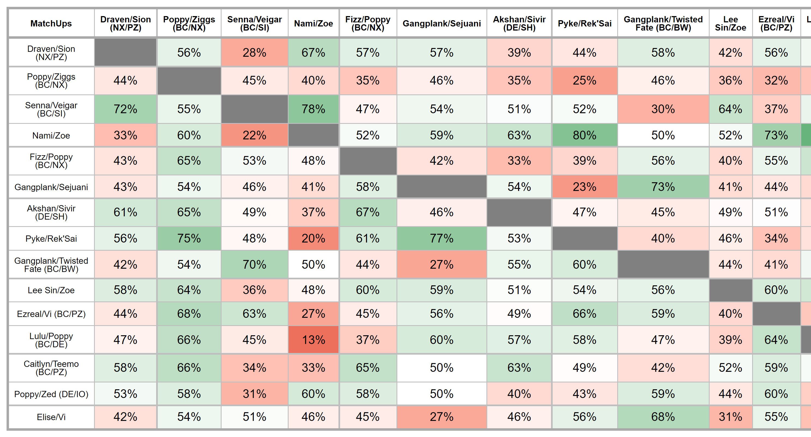

```{r}
xaringanExtra::use_panelset()


# 
# {width="100%"}
```

::: {.l-page}

```{r}
ft = flextable::flextable(dplyr::full_join(mtcars,mtcars, by ="disp"))

# flextable::save_as_image(x = ft, path = "images/test.png") |> invisible()

ft
```


:::


