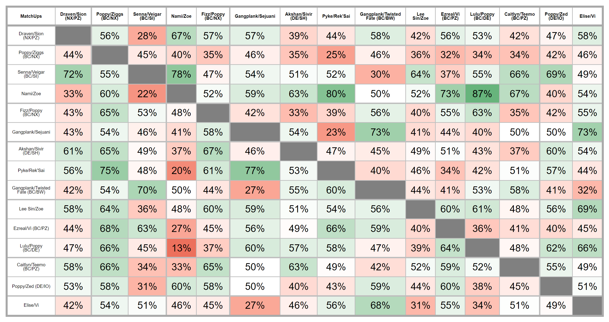

```{r setup, include=FALSE}
xaringanExtra::use_panelset()
```
::: l-page

Save the plot in a png file to include later

```{r}
graph <- "./images/plot.png"
library(ggplot2)
p <- ggplot(mpg, aes(class, hwy)) + geom_boxplot()
ggsave(graph, p)
```

Include the file in the pdf

```{r}
knitr::include_graphics(graph)
```

:::

```{r fig.width=12, fig.height=8, fig.align="center"}
# source(file.path("C:","LlorR","scripts","lor_main.R" ))
# library(plotly)
# mtcars |>
#   highlight_key(~cyl) |>
#   plot_ly(
#     x = ~wt, y = ~mpg, text = ~cyl, mode = "markers+text", 
#     textposition = "top", hoverinfo = "x+y"
#   ) |>
#   plotly::highlight(on = "plotly_hover", off = "plotly_doubleclick")

# cat(paste0(""), "\n")

# cat(glue::glue(""))
# cat(glue::glue(""))

# knitr::include_graphics(path = cat(glue::glue("./images/027-MU.png") ) )

# knitr::include_graphics(path = "./LMI.png/")

# library(knitr)    # For knitting document and include_graphics function
# library(ggplot2)  # For plotting
# library(png)      # For grabbing the dimensions of png files

img1_path <- "./images/LMI.png"
# img1 <- readPNG(img1_path, native = TRUE, info = TRUE)
# 
# # knitr::include_graphics(path = "C:/Users/Valentino Vazzoler/Documents/R/llorr-website/images/meta-report/027-MU.png/")
# knitr::include_graphics(path = "./images/027-MU.png/")
```


<!--  -->

<!-- out.width='50px', out.extra='style="float:left; padding:10px"' -->

```{r, preview=TRUE}
knitr::include_graphics("images/LMI.png")
```


<!--  -->

<!-- " -->

<!-- {width="15in"} -->
