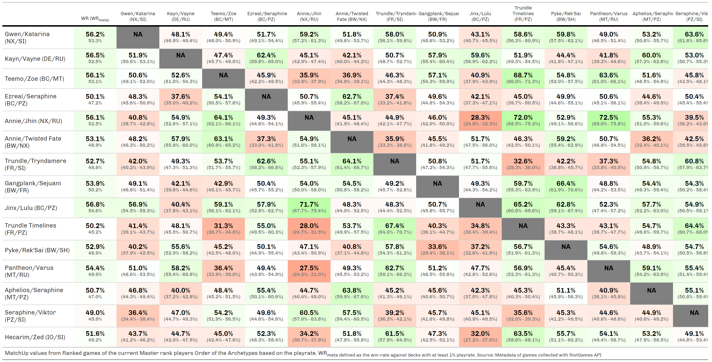
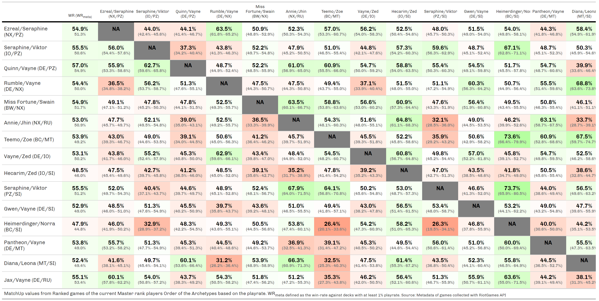
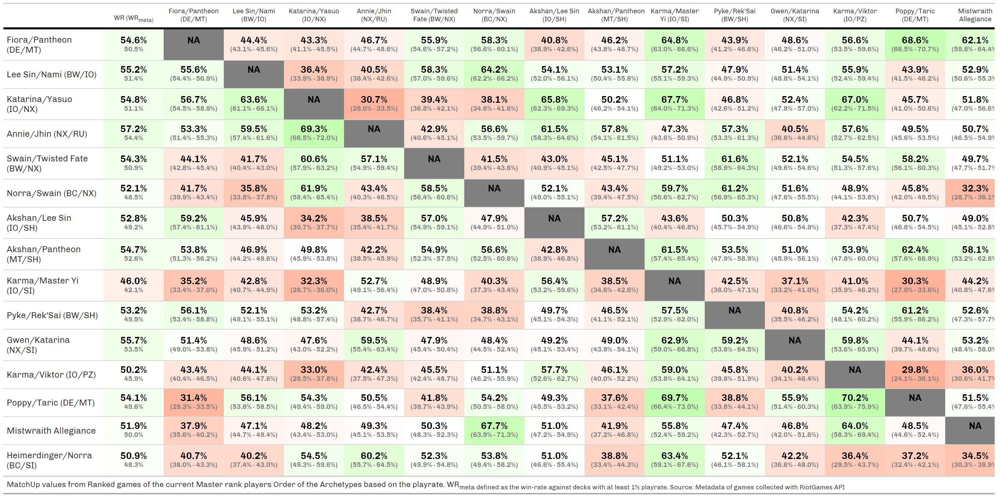

```{r setup, include=FALSE}
knitr::opts_chunk$set(
  echo       = FALSE, 
  eval       = TRUE, 
  warning    = FALSE, 
  error      = FALSE, 
  message    = FALSE, 
  comment    = NA, 
  R.options  = list(width = 140, digits.secs=6), 
  dev.args   = list(bg = 'whitesmoke'), 
  fig.align  = 'center', 
  fig.width  = 12, 
  fig.height = 8, 
  fig.path   = glue::glue("images/"), 
  layout     = "l-page", 
  preview    = TRUE
)

#' R Option
options(scipen = 999)
source(file.path("C:", "LlorR", "scripts", "lor_main.R"))
source(file.path("C:", "LlorR", "scripts", "functions", "lor_functions.R"))
# source(file.path("C:", "LlorR", "scripts", "functions", "lor_constants.R"))
xaringanExtra::use_panelset()
```

```{css}
.value-box {
  height: 100px;
}
```

```{r constants}
last_update_box <- flexdashboard::valueBox(
  Sys.Date(), 
  caption = glue::glue("Last Update / Usually done around 5:00 UTC / 7:00 CET"), 
  icon = "fa-clock", 
  color = "#1A9850")
```

```{r load-data}
MU_tbl <- data.table::fread(
  file = file.path("C:", "LlorR", "data", "clean","mu_master.csv"),
  header = T, na.strings = c("", NA), encoding = "UTF-8"
)

MU_diamond <- data.table::fread(
  file = file.path("C:", "LlorR", "data", "clean","mu_diamond.csv"),
  header = T, 
  na.strings = c("", NA),
  encoding = "UTF-8"
)

summary_info <- readr::read_rds(file = file.path("C:", "LlorR", "data", "clean","summary_info.rds") )
```

Master {data-icon="fa-table"}
================================

Row
-----------------------------------------------------------------------

### Box MU

```{r}
flexdashboard::valueBox(glue::glue("{summary_info$nRankedMaster} Master Ranked Games"), 
                        caption = glue::glue("min 10 games - {summary_info$nMuMaster} games used"), 
                        icon = "fa-table", 
                        color = "#FA7404") -> master_valuebox

master_valuebox
```

### Box Master

```{r value-player-master}
flexdashboard::valueBox(value = summary_info$nMaster, 
                        caption = glue::glue("Master Players"), 
                        icon = "fa-medal", 
                        color = "#65c0a9") -> box_master

box_master
```

### Last Update

```{r}
last_update_box
```

Inputs {.sidebar}
-----------------------------------------------------------------------

### Filters

```{r filters-master}
crosstalk_data <- crosstalk::SharedData$new(MU_tbl)

crosstalk::filter_select("playerDeck", "Player's Deck",     crosstalk_data, ~playerDeck)
crosstalk::filter_select("opponentDeck", "Opponent's Deck", crosstalk_data, ~opponentDeck)

crosstalk::filter_slider("muWin",   "#Win",                 crosstalk_data, ~muWin,   step = 50 , min = 0)
crosstalk::filter_slider("muGames", "#Games",               crosstalk_data, ~muGames, step = 100, min = 0)

crosstalk::filter_slider("muWR", "WinRate",                 crosstalk_data, ~muWR, step=0.01, min = 0, max = 1)
crosstalk::filter_slider("playrate", "Player PlayRate",     crosstalk_data, ~playrate, step=0.01, min = 0,   max = round(max(MU_tbl$playrate),   4) )
crosstalk::filter_slider("opponentPR", "Opponent PlayRate", crosstalk_data, ~opponentPR, step=0.01, min = 0, max = round(max(MU_tbl$opponentPR), 4) )

crosstalk::filter_select("direction", "MU-Direction",       crosstalk_data, ~direction)
crosstalk::filter_checkbox("mirror", "Mirror",              crosstalk_data, ~mirror, inline = TRUE)
```

Row {data-heigth="750"}
-----------------------------------------------------------------------

### MU table

```{r print-react-master}
reactable_mu(crosstalk_data)
```

Diamond {data-icon="fa-table"}
================================

Row
-----------------------------------------------------------------------

### Box MU

```{r}
flexdashboard::valueBox(glue::glue("{summary_info$nRankedDiamond} Master Ranked Games"), 
                        caption = glue::glue("min 10 games - {summary_info$nMuDiamond} games used"), 
                        icon = "fa-table", 
                        color = "#FA7404") -> diamond_valuebox

diamond_valuebox
```

```{r value-player-diamond}
flexdashboard::valueBox(value = summary_info$nDiamond, 
                        caption = glue::glue("HighDiamond Players"), 
                        icon = "fa-diamond",
                        color = "#ff7f24") -> box_diamond

box_diamond
```

### Last Update

```{r}
last_update_box
```

Inputs {.sidebar}
-----------------------------------------------------------------------

### Filters

```{r filters-diamond}
crosstalk_diamond <- crosstalk::SharedData$new(MU_diamond)

crosstalk::filter_select("playerDeck", "Player's Deck",     crosstalk_diamond, ~playerDeck)
crosstalk::filter_select("opponentDeck", "Opponent's Deck", crosstalk_diamond, ~opponentDeck)

crosstalk::filter_slider("muWin",   "#Win",                 crosstalk_diamond, ~muWin,   step = 50 , min = 0)
crosstalk::filter_slider("muGames", "#Games",               crosstalk_diamond, ~muGames, step = 100, min = 0)

crosstalk::filter_slider("muWR", "WinRate",                 crosstalk_diamond, ~muWR, step=0.01, min = 0, max = 1)
crosstalk::filter_slider("playrate", "Player PlayRate",     crosstalk_diamond, ~playrate,   step=0.01, min = 0, max = round(max(MU_diamond$playrate),   4) )
crosstalk::filter_slider("opponentPR", "Opponent PlayRate", crosstalk_diamond, ~opponentPR, step=0.01, min = 0, max = round(max(MU_diamond$opponentPR), 4) )

crosstalk::filter_select("direction", "MU-Direction",       crosstalk_diamond, ~direction)
crosstalk::filter_checkbox("mirror", "Mirror",              crosstalk_diamond, ~mirror, inline = TRUE)
```

Row {data-heigth="750"}
-----------------------------------------------------------------------

### MU table

```{r print-react-diamond}
reactable_mu(crosstalk_diamond)
```

Grid {data-icon="fa-file-image"}
================================

Row
-----------------------------------------------------------------------

### Box1 MU

```{r}
master_valuebox
```

### Box2 MU

```{r}
diamond_valuebox
```

### Last Update

```{r}
last_update_box
```

Row {data-heigth="850" .tabset}
-----------------------------------------------------------------------

### MU Grid

```{r print-grid}
gtMU_grid <- readr::read_rds(file = file.path("C:", "LlorR", "data", "clean","grid_master.rds"))

gtMU_grid |>
  gt::tab_options(
    data_row.padding = gt::px(8),
    table.font.size  = gt::px(13),
    column_labels.font.size = gt::px(10)
  ) |>
  gt::cols_width(
    -1 ~ gt::px(90),
    1  ~ gt::px(150),
  ) |>
  gtExtras::gt_theme_dark()
```

### MU Grid - Diamond

```{r print-diamond-grid}
gtMU_grid <- readr::read_rds(file = file.path("C:", "LlorR", "data", "clean","grid_diamond.rds"))

gtMU_grid |>
  gt::tab_options(
    data_row.padding = gt::px(8),
    table.font.size  = gt::px(13),
    column_labels.font.size = gt::px(10)
  ) |>
  gt::cols_width(
    -1 ~ gt::px(90),
    1  ~ gt::px(150),
  ) |>
  gtExtras::gt_theme_dark()
```

Grid Older Patch  {data-icon="fa-file-image"}
================================

Row {.tabset}
-----------------------------------------------------------------------

### Patch 3.19 - Patch 3.20 - Darkin Saga: Domination - November Balance Patch



### Patch 3.17 - Patch 3.18 - Darkin Saga: Domination



### Patch 3.16



Downloads and Informations {data-orientation="columns" data-icon="fa-info-circle"}
================================

Download {data-width="250"}
-----------------------------------------------------------------------

### Match Ups Data

```{r download-master}
downloadthis::download_file(
  path = file.path("data/mu_master.csv"),
  button_label = glue("Download MU (Masters) data as .csv
                        min 10 games"), 
    output_name = "mutable", 
    button_type = "success", 
    has_icon = TRUE, 
    icon = "fa fa-save"
)
```

```{r download-diamond}
downloadthis::download_file(
  path = file.path("data/mu_diamond.csv"),
  button_label = glue("Download MU (HighDiamond) data as .csv
                        min 10 games"), 
    output_name = "mutable", 
    button_type = "success", 
    has_icon = TRUE, 
    icon = "fa fa-save"
)
```

### Match Ups Grid

```{r download-grid}
downloadthis::download_file(
  path = file.path("images/mugrid.png"), 
  button_label = "Download MU grid as .png", 
  button_type = "primary", 
  has_icon = TRUE, 
  icon = "fa fa-save", 
  self_contained = FALSE
)
```

Column {data-width="750"}
-----------------------------------------------------------------------

### How to use

#### Filters

The format of the table is the usual way I display the match-ups data but I also displayed additional variables that I normally remove in the report:

-   **Player's Deck** - deck's archetype of the playerDeck

-   **Opponent's Deck** - deck's archetype of the opponentDeck

-   **#Win** - min number of wins for a match-up

-   **#Games** - min number of games for a match-up

-   **Regions** - regions of the 'Player' deck.

-   **MU-Direction** - simply if the MU is positive (win rate > 50%) or negative (win rate \< 50%) for the 'Player' or tie (win rate = 50%)

-   **Mirror** - hide or include mirror match-ups

#### Archetypes Fix

```{r}
tbl_archetype
```

#### General info

When I refer to games it's always refering a single playerDeck. So, if I have the information of 1 match it's equivalent to 2 games.
