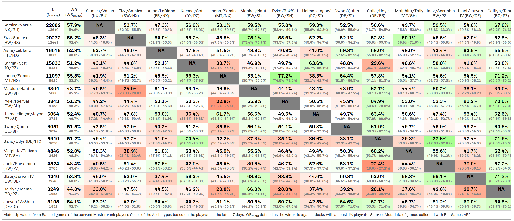
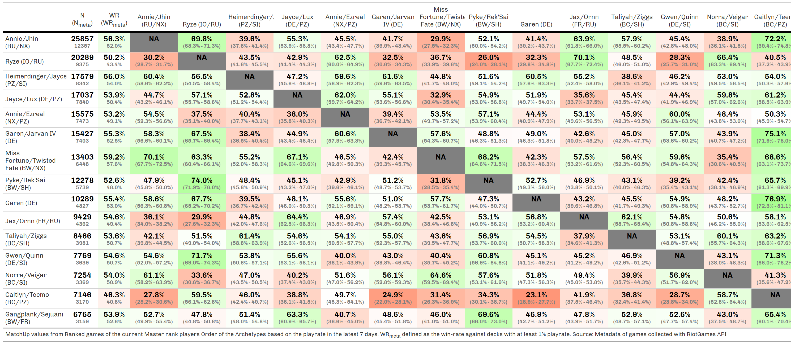
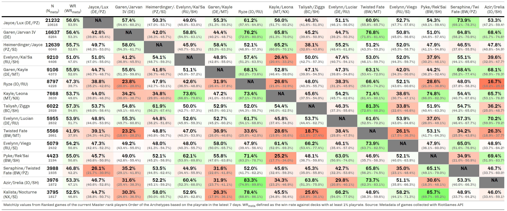
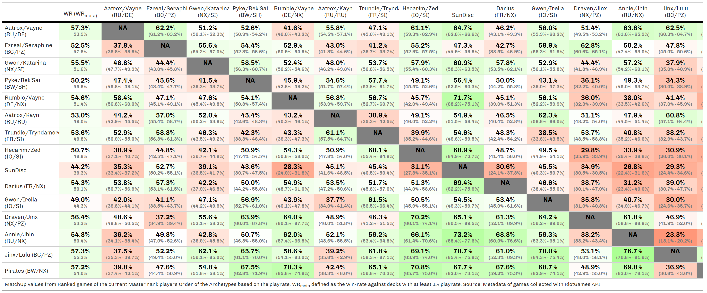
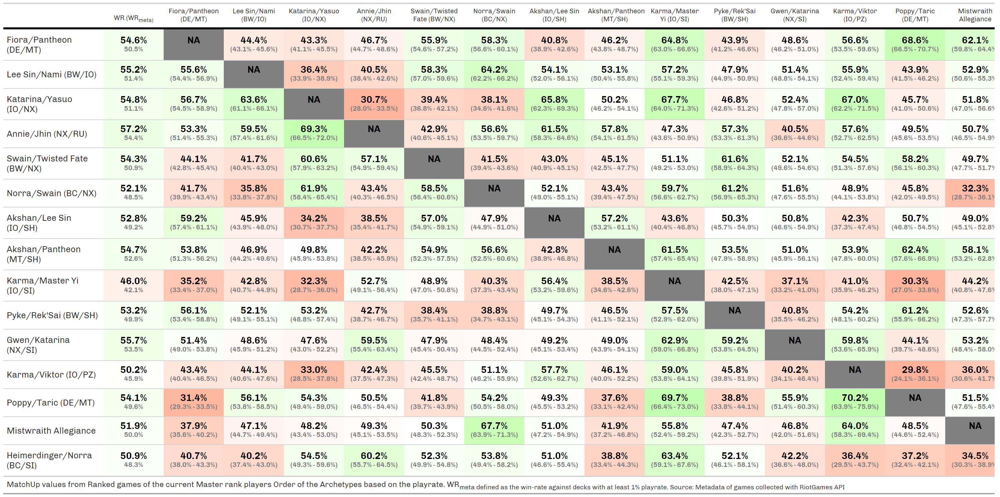

```{r setup, include=FALSE}
knitr::opts_chunk$set(
  echo       = FALSE, 
  eval       = TRUE, 
  warning    = FALSE, 
  error      = FALSE, 
  message    = FALSE, 
  comment    = NA, 
  R.options  = list(width = 140, digits.secs=6), 
  dev.args   = list(bg = 'whitesmoke'), 
  fig.align  = 'center', 
  fig.width  = 12, 
  fig.height = 8,
  layout     = "l-page", 
  preview    = TRUE
)

xaringanExtra::use_panelset()
```

```{r panelset-style}
xaringanExtra::style_panelset_tabs(
  font_family        = "Helvetica", 
  active_foreground  = "white", 
  hover_foreground   = "black", 
  hover_border_color = "black", 
  active_background  = "#007fff"
  )
```


## Glory in Navori

::: l-page
::::: panelset

::: panel
### April - Patch 4.3 {.panel-name}
{width="1024"}
:::

:::::
:::


## Beta Season

::: l-page
::::: panelset

::: panel
### March - Patch 4.2 {.panel-name}
Variety cards
{width="1024"}
:::

::: panel
### February - Patch 4.1 {.panel-name}
Balance Patch
{width="1024"}
:::

:::::
:::

## The Darkin Saga

::: l-page
::::: panelset

::: panel
### World Ender - Patch 3.21 - Patch 3.22 {.panel-name}
{width="1024"}
:::

::: panel
### Domination - Patch 3.19 - Patch 3.20 {.panel-name}
November Balance Patch
{width="1024"}
:::

::: panel
### Domination - Patch 3.17 - Patch 3.18 {.panel-name}
{width="1024"}
:::

::: panel
### Awakening - Patch 3.16 {.panel-name}
Late September Balance Patch
{width="1024"}
:::

::: panel
### Awakening - Patch 3.14 - 3.15 {.panel-name}
Late September Balance Patch
{width="1024"}
:::

:::::
:::

The playrate are from the last 7 days of each meta.
