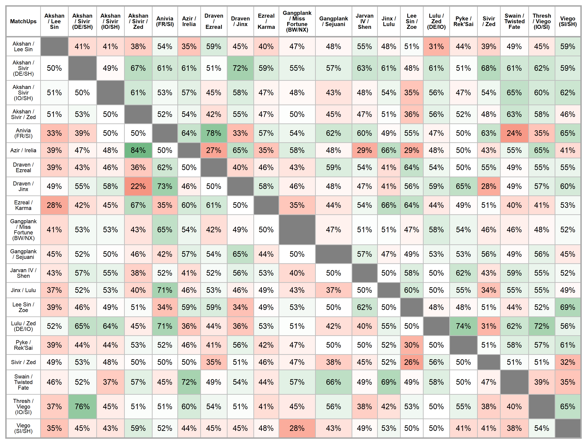

```{r setup, include=FALSE}
knitr::opts_chunk$set(
  echo = FALSE,
  warning = FALSE,
  error = FALSE,
  message = FALSE,
  dev.args = list(bg = 'transparent'),
  # dev='svglite',
  fig.align='center',
  #out.width='75%', fig.asp=.75,
  cache.rebuild = F,
  cache = F
)

source(file.path("C:","LlorR","scripts","lor_main.R" ))
options(digits.secs = 6)
options(scipen=999)

#' R Option
pacman::p_load(tidyverse,data.table,DT,reactable,crosstalk,
               flextable,officer,scales,htmltools,
               downloadthis)
```

```{r load-data}
#' load DeckDT
#'############
LoR.Deck        <- fread(file.path("C:","LlorR","data","raw","LoR_DECK.csv"),na.strings = c("",NA))

file.DT <- file.path("C:","LlorR","data","raw","LoR_MatchDT.csv")
header        <- fread(file.DT, header = FALSE, na.strings = c("",NA), nrows = 1, stringsAsFactors = FALSE)
LoR.Match.RMD <- fread(file.DT, header = FALSE, na.strings = c("",NA), skip = params$skip )
colnames(LoR.Match.RMD) <- unlist(header,use.names = F)
```

```{r process-data}
#' Metl tbl
#'#########
LoR.Melt.Matches.RMD <- LoR.Match.RMD |>
  #' Base filters
  filter( game_type=="Ranked" ) |>
  filter( game_start_time_utc > as.POSIXct("2021-09-01 21:00:00", tz = "UTC") ) |>
  # filter( game_start_time_utc >= as.POSIXct(params$start, tz = "UTC") & game_start_time_utc < as.POSIXct(params$end, tz = "UTC") ) |>
  #' 'process' data
  left_join(LoR.Deck[,.(deck_code,archetype)] |> setnames(old = "archetype", new = "player_1")   ,by=c("deck_code_1"="deck_code")) |>
  left_join(LoR.Deck[,.(deck_code,archetype)] |> setnames(old = "archetype", new = "opponent_1") ,by=c("deck_code_2"="deck_code")) |>
  mutate( player_2 = opponent_1, opponent_2 = player_1, oppoppuid_1 = puuid_2, oppoppuid_2 = puuid_1 ) |>
  select( match_key,server,game_start_time_utc,game_version,total_turn_count,
          ends_with("_1"),ends_with("_2"),-ends_with("_3"),-ends_with("_4"),-contains("deck_id"),-contains("participants") ) |>
  #' melt data
  melt(id.vars=c("match_key","server","game_start_time_utc","game_version","total_turn_count"), measure.vars=patterns(
    str_sub(
      names(select(.,ends_with("_1")))
      ,end = -3)
  ),
  value.name = str_sub(
    names(select(.,ends_with("_1")))
    ,end = -3)
  )
# |>
#   #' finish 'process' data
#   left_join(. , LoR.Account.RMD[,c("puuid","RiotID","refID")] |> setnames(old = "RiotID", new = "userID")     ,by=c("puuid"="puuid")) |>
#   left_join(. , LoR.Account.RMD[,c("puuid","RiotID")] |> setnames(old = "RiotID", new = "opponentID") ,by=c("oppoppuid"="puuid")) |>
#   left_join(.,LoR.Deck |> select(!archetype),by=c("deck_code","factions")) |>
#   select(-ends_with("puuid"),-refID,-contains("puuid"))
```

# Table {data-icon="fa-chart-line"}

## Inputs {.sidebar}

### Filters

```{r filters}
# bscols(
#   crosstalk::filter_select("player", "Player", data, ~player),
#   crosstalk::filter_select("opponent", "Opponent", data, ~opponent)
# )
```

## Row {data-heigth="750"}

### Meta Evolution table

```{r}
m = 10

Champion.deck.daily <- (LoR.Melt.Matches.RMD |>
  rename("champions"="player") |>
  arrange(game_start_time_utc) |>
  select(game_start_time_utc,champions) |>
  mutate( num_cc = factor(champions) |> as.numeric() ))[ , cumFreq := (cumsum(num_cc)/num_cc)/.I , by=champions ] |>
  select(!num_cc) |>
  mutate( champions = factor(champions) |> fct_infreq() )

Champion.deck.daily.byserver <- (LoR.Melt.Matches.RMD |>
  rename("champions"="player") |>
  arrange(game_start_time_utc) |>
  group_by(server) |>
  select(game_start_time_utc,champions,server) |>
  mutate( num_cc = factor(champions) |> as.numeric() ) |>
    ungroup() |> as.data.table())[ , cumFreq := (cumsum(num_cc)/num_cc)/.I , by=champions ] |>
  select(!num_cc) |>
  mutate( champions = factor(champions) |> fct_infreq() )

fct_values <- LoR.Melt.Matches.RMD |>
 mutate( top5 = fct_lump_n(player,n = m) |> fct_infreq() ) |>
 pull(top5) |> levels()
```


```{r print-react-MU}

```

## Row

### Number of Games (min 10 games for each MU)

```{r value-nGames}
nGames = MUtbl |> 
  filter( muGames > nfilter ) |>
  summarise(n = sum(muGames)) |>
  pull()

flexdashboard::valueBox(glue::glue("{nGames} Ranked Games"),
                        # caption = glue::glue(""),
                        icon = "fa-table",
                        color = "#FA7404")
```

### Last Update

```{r value-Games}
flexdashboard::valueBox(Sys.Date(),
         icon = "fa-clock",
         color = "lightgreen")
```

# Grid {data-icon="fa-file-image"}

```{r get-WR-Top}
mu <- 20

TopCC <- MUtbl |>
  group_by(player) |>
  summarise(nGames = sum(muGames)) |> 
  arrange(desc(nGames)) |>
  slice_head(n = mu) |> 
  select(player) |>
  pull() # |> sort()


WRTopCC <- tibble::tibble( 
  player = rep(TopCC,each=mu),
  opponent = rep(TopCC,mu)
  ) |>
  left_join(MUtbl, by = c("player","opponent"))
```

<!-- The win rates on the grid are among the `r mu` most played champion combination. -->

```{r prepare-flex}
big_border   = fp_border(color="darkgray", width = 2)
small_border = fp_border(color="gray", width = 1)

dummy_fun <- function(x){
  ifelse( !is.na(x),sprintf( "%.0f%%", x*100 ),NA )
}
```

```{r prepare-flex-grid}
grid <- matrix(WRTopCC$muWR, nrow = mu, ncol = mu, byrow = T)
diag(grid) <- NA

colnames(grid) <- TopCC
colourer <- col_numeric(
  palette = c("#D73027", # red
          # "#f9ccac", # red/orange
          "white",
          # "#e3eaa7", # green
          "#1A9850" # darker green
          ),
  domain = c(0, 1))

funs <- setNames(rep(list(dummy_fun), mu), TopCC)
```

```{r create-flex}
ft <- grid |> 
  as_tibble() |>
  # mutate(across(everything(),~scales::percent(.x, accuracy = 0.1 ))) |>
  add_column(.,TopCC,.before = TopCC[1]) |>
  rename("MatchUps"="TopCC") |>
  flextable::flextable(.) |> 
  theme_vanilla( ) |>
  # theme_booktabs(bold_header = TRUE) |> 
  flextable::align(.,align = "center", part = "all") |>
  flextable::bg(.,
    bg = colourer,
    j = ~ . -MatchUps,
    part = "body") |> 
  border_remove(x = .) |>
  border_outer(., part="all", border = big_border ) |>
  border_inner_h(., part="all", border = small_border ) |>
  border_inner_v(., part="all", border = small_border ) |>
  set_formatter(values = funs) |>
  fontsize(., size = 8, part = "header") |>
  fontsize(., j=1, size = 8) |>
  bg(., part = "header", bg = "white"  ) |>
  bg(., j = 1, bg = "white"  ) |>
  autofit() 
  # bold(., j=1, bold = TRUE) |>
  # width(., width = 1.5)
```

```{r print-flex}
save_as_image(x = ft, path = "images/mugrid.png") |> invisible()
ft
```

<!--  -->

```{r}
# knitr::include_graphics(path = "./images/mugrid.png")
```

# Grid 2.12/2.13 {data-icon="fa-file-image"}



# Downloads and Informations {data-orientation="columns" data-icon="fa-info-circle"}

## Download {data-width="200"}

### Match Ups Data

```{r}
MUtbl |>
  filter( muGames > 10 ) |>
  select(player,opponent,muWin,muGames,muWR) |>
  download_this(.,
              button_label = "Download MU data as .csv",
              output_name = "mutable",
              button_type = "success",
              has_icon = TRUE,
              icon = "fa fa-save"
              )
```

### Match Ups Data (2.12/2.13)

```{r}
# MUtbl |>
#   filter( muGames > 10 ) |>
#   fwrite( "data/mutbl_patch_2_12to13.csv" )
fread("data/mutbl_patch_2_12to13.csv") |>
  select(player,opponent,muWin,muGames,muWR) |>
  download_this(.,
              button_label = "Download MU data (2.12/2.13) as .csv",
              output_name = "mutable",
              button_type = "success",
              has_icon = TRUE,
              icon = "fa fa-save"
              )
```

### Match Ups Grid

```{r}
download_file(
  path = file.path("images/mugrid.png"),
  # path = system.file("assets/css/all.min.css", package = "downloadthis"),
  button_label = "Download MU grid as .png",
  button_type = "primary",
  has_icon = TRUE,
  icon = "fa fa-save",
  self_contained = FALSE
)
```

### Match Ups Grid (2.12/2.13)

```{r}
download_file(
  path = file.path("images/mugrid_patch_2_12to13.png"),
  # path = system.file("assets/css/all.min.css", package = "downloadthis"),
  button_label = "Download MU grid (2.12/2.13) as .png",
  button_type = "primary",
  has_icon = TRUE,
  icon = "fa fa-save",
  self_contained = FALSE
)
```

## Column {data-width="800"}

### How to use

#### Filters

The format of the table is the usual way I display the match-ups data but I also displayed additional variables that I normally remove in the report:

-   **Player** - archetype of the player

-   **Opponent** - archetype of the opponent

-   **\#Win** - min number of wins for a match-up

-   **\#Games** - min number of games for a match-up

-   **Regions** - regions of the 'Player' deck.

-   **MU-Direction** - simply if the MU is positive (win rate \> 50%) or negative (win rate \< 50%) for the 'Player' or tie (win rate = 50%)

#### General info

When I refer to games it's always refering a single player. So, if I have the information of 1 match it's equivalent to 2 games.

`r kableExtra::text_spec("UPDATE:", color = "red")` the API problem has been fixed so I can return to collect the games. Since it would be a shame to trow away all the old data since I have only few games with the old patch I added the grid for the previous cycle of buff/nerfs as it can still provide informations for MU that didn't change from the release of BandleCity (looking at you Soraka).

While I could add the table too it would probably clog the page too much and distract from the current data. But as an alternative I added the change to download the old-patch data if one really needs them.

<!-- ### General update -->

<!-- Last Update: `r Sys.time()` -->
