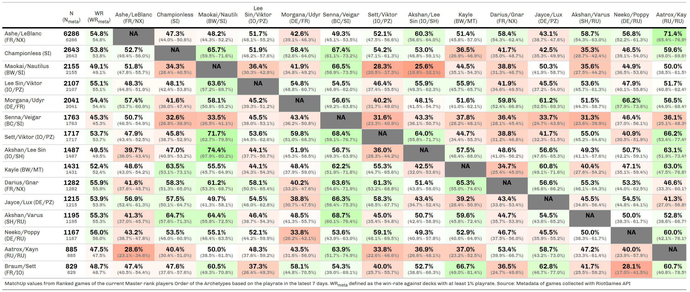

```{r}
# 6/1/21 07:00 PM Game Updates PATCH 2.9.0 NOTES
# 6/29/21 07:00 PM Game Updates PATCH 2.11.0 NOTES <- Rise Underworld
# 7/13/21 07:00 PM Game Updates PATCH 2.12.0 NOTES <- Ruination # Viego & Akshan arrive in patch 2.12.0, which will be playable at approximately 11AM PT, July 14.
```

```{r setup, include=FALSE}
knitr::opts_chunk$set(
  echo = FALSE,
  eval = TRUE,
  warning = FALSE,
  error = FALSE,
  message = FALSE,
  comment = NA,
  R.options = list(width = 140,
                   digits.secs=6),
  dev.args = list(bg = 'transparent'), # make graphics with transparent background
  fig.align = 'center',
  fig.width=12,
  fig.height=8,
  engine.path = list(
    python = 'C:/anaconda/'   # -> use_python("C:/anaconda/")
  ),
  #'distill options
  layout="l-body-outset",
  preview=FALSE
)

#' R Option
options(scipen = 999)
source(file.path("C:","LlorR","scripts","lor_main.R"))
xaringanExtra::use_panelset()
```

```{r load-data}
#' load DeckDT
#'############
LoR.Deck.RMD        <- fread(file.path("C:","LlorR","data","raw","LoR_DECK.csv"),na.strings = c("",NA))

#' load Games DT
#'##############
LoR.Match.RMD <- fread(file.path("C:","LlorR","data","raw","LoR_TempDT.csv"), header = T, na.strings = c("",NA) )

#' Read New Master
##################
LoR.Master.RMD <- fread(file.path("C:","LlorR","data","raw","LoR_MatchDT.csv"), header = T, na.strings = c("", NA))

# file.DT <- file.path("C:","LlorR","data","raw","LoR_MatchDT_patch_2_04_to_17final.csv")
# header        <- fread(file.DT, header = FALSE, na.strings = c("",NA), nrows = 1, stringsAsFactors = FALSE)
# LoR.Match.RMD <- fread(file.DT, header = FALSE, na.strings = c("",NA), skip = params$skip )
# colnames(LoR.Match.RMD) <- unlist(header,use.names = F)
```

```{r archetype-fix}
#' Limit the Deck DT to make the fixes much faster
deck_filter <- LoR.Match.RMD |>
  #' Base filters
  filter( game_type=="Ranked" ) |>
  filter( game_start_time_utc > as.POSIXct(params$start, tz = "UTC") ) |>
  select(deck_code_1,deck_code_2) |>
  pivot_longer( cols = contains("deck_code"),values_to = "decks" ) |>
  filter(decks!="") |>
  distinct(decks)

LoR.Deck.RMD <- LoR.Deck.RMD[deck_code %in% deck_filter$decks]

#' Archetype-Fix
#'##############
source(file.path("C:","LlorR","scripts","functions","lor_archetype_rmd.R"))

# LoR.Deck.RMD[ ,tabyl(archetype_pretty) ]

#' Archetype names fix
######################
LoR.Deck.RMD[ !is.na(archetype_pretty), archetype:=archetype_pretty ]
```

```{r process-data}
#' Melt tbl
#'#########
LoR.Melt.Matches.RMD <- LoR.Match.RMD |>
  filter( game_type=="Ranked" ) |>
  # filter( game_start_time_utc > as.POSIXct(params$start, tz = "UTC") ) |>
  filter( game_start_time_utc >= as.POSIXct(params$start,"UTC") & game_start_time_utc < as.POSIXct(params$end,"UTC") ) |>
  select( -ends_with("_3"),-ends_with("_4")  ) |>
  left_join(LoR.Deck.RMD[,.(deck_code,playerDeck_1=archetype)],  by=c("deck_code_1"="deck_code")) |>
  left_join(LoR.Deck.RMD[,.(deck_code,opponentDeck_1=archetype)],by=c("deck_code_2"="deck_code")) |>
  rename( playerPuuid_1 = puuid_1, playerPuuid_2 = puuid_2 ) |>
  mutate( playerDeck_2 = opponentDeck_1, opponentDeck_2 = playerDeck_1, opponentPuuid_1 = playerPuuid_2, opponentPuuid_2 = playerPuuid_1 ) |>
  pivot_longer(cols = c(ends_with("_1"),ends_with("_2")),
               names_to = c(".value"),
               names_pattern = "(.*)_[0-9]"
               ) |>
  as.data.table()

# LoR.Melt.Matches.RMD[ is.na(playerDeck), .N ]
```

```{r prepare-data-new}
LoR.Melt.Master.RMD <- LoR.Master.RMD |>
  filter( game_type == "Ranked"  ) |>
  filter( game_start_time_utc >= as.POSIXct(params$start,"UTC") & game_start_time_utc < as.POSIXct(params$end,"UTC") ) |>
  select( -ends_with("_3"),-ends_with("_4")  ) |>
  left_join(LoR.Deck.RMD[,.(deck_code,playerDeck_1=archetype)],  by=c("deck_code_1"="deck_code")) |>
  left_join(LoR.Deck.RMD[,.(deck_code,opponentDeck_1=archetype)],by=c("deck_code_2"="deck_code")) |>
  mutate( playerDeck_2 = opponentDeck_1, opponentDeck_2 = playerDeck_1 ) |>
  pivot_longer(cols = c(ends_with("_1"),ends_with("_2")),
               names_to = c(".value"),
               names_pattern = "(.*)_[0-9]"
               )


```

```{r process-MU}
#' WR tbl
#'#######
WR.DT <- LoR.Melt.Matches.RMD |>
  filter(game_outcome!="tie") |>
  select( playerDeck,opponentDeck,game_outcome ) |>
  group_by(playerDeck) |>
  summarise( nWin   = sum(game_outcome=="win"),
             nGames = n(),
             WR=mean(game_outcome=="win")
  ) |>
  ungroup() |>
  mutate( playrate = nGames/sum(nGames) )

#' MU tbl the date is already filtered
#'####################################
MUtbl <- LoR.Melt.Matches.RMD |>
  filter( game_outcome != "tie" ) |>
  select( playerDeck,opponentDeck,game_outcome,server,game_version,factions ) |>
  group_by(playerDeck,opponentDeck,factions) |>
  summarise( 
    muWin   = sum(game_outcome=="win"),
    muGames = n(),
    muWR=mean(game_outcome=="win")
    ) |>
  ungroup() |>
  mutate(
    factions = map_chr(.x = factions, ~str_remove_all(.x, paste(c("_Name","faction_", ""), collapse = "|") ) ),
    CI   = map2_df(.x=muWin,.y = muGames, .f = ~binom::binom.confint(.x,.y,0.95,methods="exact")[,c("lower","upper")] )
    ) |>
  chop(CI) |>
  unnest(CI) |>
  mutate( okCI = map2_lgl(.x = lower,.y = upper, ~ !between(0.50,.x,.y) ) ) |>
  mutate( direction = ifelse(muWR>0.50,"POS","NEG") ) |>
  mutate( direction = replace(direction,direction==0.50,"TIE") ) |>
  mutate( CI := glue::glue("({scales::percent(lower,accuracy = 0.1)}-{scales::percent(upper,accuracy = 0.1)})" ) ) |>
  # removing ~extra variables
  select(-lower,-upper) |>
  left_join(WR.DT[,c("playerDeck","playrate")],by="playerDeck") |>
  relocate(factions,.after = muWR)
```
# Table {data-icon="fa-table"}

```{r}
nfilter <- 10

MUtbl.tot <- sum(MUtbl$muGames)

data <- crosstalk::SharedData$new(
  MUtbl |>
    filter(muGames >= nfilter)
)
```

## Inputs {.sidebar}

### Filters

```{r filters}
crosstalk::filter_select("playerDeck", "Player's Deck", data, ~playerDeck)
crosstalk::filter_select("opponentDeck", "Opponent's Deck", data, ~opponentDeck)

crosstalk::filter_slider("muWin",   "#Win",  data, ~muWin,   step = 50 ,min = 0)
crosstalk::filter_slider("muGames", "#Games",data, ~muGames, step = 100,min = 0)

crosstalk::filter_slider("muWR", "WinRate", data, ~muWR,step=0.01,min = 0,max = 1)
crosstalk::filter_slider("playrate", "PlayRate", data, ~playrate,step=0.01,min = 0,max = round(max(MUtbl$playrate),4) )

crosstalk::filter_select("direction", "MU-Direction", data, ~direction)
```

## Row {data-heigth="750"}

### MU table

```{r print-react-MU}
# require(htmltools)

# Render a bar chart with positive and negative values
bar_chart_pos_neg <- function(label, value, max_value = 1, height = "12px",pos_fill = "#005ab5", neg_fill = "#dc3220") {
  
  base_chart <- htmltools::div(style = list(flex = "1 1"))
  # pos_chart <- htmltools::div(style = list(flex = "1 1"))
  width <- paste0((value / max_value) * 100, "%")

  if (value >= 0.5) {
    bar <- htmltools::div(style = list(marginLeft = "8px",marginRight = "8px", background = pos_fill, width = width, height = height))
    chart <- htmltools::div(style = list(display = "flex", alignItems = "center"), bar, label)
    base_chart <- htmltools::tagAppendChild(base_chart, chart)
    htmltools::div(style = list(display = "flex"), base_chart)
  } else {
    bar <- htmltools::div(style = list(marginLeft = "8px",marginRight = "8px", background = neg_fill, width = width, height = height))
    chart <- htmltools::div(style = list(display = "flex", alignItems = "center"), bar, label)
    base_chart <- htmltools::tagAppendChild(base_chart, chart)
    htmltools::div(style = list(display = "flex"), base_chart)
  }
}

data |>
  reactable(
    bordered = TRUE,
    highlight = TRUE,
    striped = TRUE,
    searchable = TRUE,
    compact = TRUE, # compact the table height
    fullWidth = T, # don't fill the page
    defaultPageSize = 20,
    wrap = TRUE,
    defaultSorted = list(muGames = "desc"),
    # filterable = TRUE,
    defaultColDef = colDef(
      style = list(fontFamily = "Roboto", fontSize = "13px"), align = "center"
      # minWidth = 120,
      ),
    columns = list(
      playerDeck   = colDef(name = "Player",minWidth = 120, style = list(fontSize = "11px", fontWeight = "bold", color="black") ),
      opponentDeck = colDef(name = "Opponent"  ,minWidth = 120, style = list(fontSize = "11px", fontWeight = "bold", color="black")),
      muWin    = colDef(name = "#Win" ), # , style = list( fontSize = "13px")
      muGames  = colDef(name = "#Games",defaultSortOrder = "desc"),
      muWR  = colDef(
        name = "Win Rate",
        # defaultSortOrder = "desc",
        cell = function(value) {
          label <- paste0(round(value * 100,1), "%")
          bar_chart_pos_neg(label, value)
          },
        align = "center",
        minWidth = 200
        ),
      playrate = colDef(name = "PlayRate",format = colFormat(percent = TRUE,digits = 1), style = list( fontSize = "13px") ),
      factions = colDef(name = "Regions"),
      CI       = colDef(name = "CI",minWidth = 120, style = list(fontSize = "13px")),
      LCI       = colDef(show=F), # lower
      UCI       = colDef(show=F), # lower
      direction = colDef(show=F),
      okCI      = colDef(show=F)
      )
    )
```

## Row

### Number of Games (min 10 games for each MU)

```{r value-nGames}
nGames = MUtbl |> 
  filter( muGames > nfilter ) |>
  summarise(n = sum(muGames)) |>
  pull()

flexdashboard::valueBox(glue::glue("{nGames} Ranked Games"),
                        caption = glue::glue("out of a total of {MUtbl.tot} - min 10 games"),
                        icon = "fa-table",
                        color = "#FA7404")
```

### Last Update

```{r value-update}
flexdashboard::valueBox(Sys.Date(),
         icon = "fa-clock",
         color = "lightgreen")
```

# Grid {data-icon="fa-file-image"}

## Row {data-heigth="850"}

### MU Grid

```{r get-WR-Top}
mu <- 15

TopCC <- MUtbl |>
  group_by(playerDeck) |>
  summarise(nGames = sum(muGames)) |> 
  arrange(desc(nGames)) |>
  slice_head(n = mu) |> 
  select(playerDeck) |>
  pull() # |> sort()


WRTopCC <- tibble::tibble( 
  playerDeck = rep(TopCC,each=mu),
  opponentDeck = rep(TopCC,mu)
  ) |>
  left_join(MUtbl, by = c("playerDeck","opponentDeck"))
```
```{r mu-master}
MUtbl.Master <- tibble::tibble( 
  playerDeck = rep(TopCC,each=mu),
  opponentDeck = rep(TopCC,mu)
  ) |> 
  left_join( LoR.Melt.Master.RMD |>
  filter( playerDeck %in% TopCC & opponentDeck %in% TopCC ) |>
  filter(game_outcome!="tie") |>
  select( playerDeck,opponentDeck,game_outcome,server ) |>
  group_by(playerDeck,opponentDeck) |>
  summarise( muWin   = sum(game_outcome=="win"),
             muGames = n(),
             muWR=mean(game_outcome=="win") ) |>
  as.data.table(), by = c("playerDeck","opponentDeck")) |>
  mutate( muWR = replace(muWR, muGames < 30, NA ) )
```

```{r create-grid}
grid <- matrix(WRTopCC$muWR, nrow = mu, ncol = mu, byrow = T)
diag(grid) <- NA
colnames(grid) <- TopCC

grid.plus <- matrix(MUtbl.Master$muWR, nrow = mu, ncol = mu, byrow = T)
diag(grid.plus) <- NA
colnames(grid.plus) <- sprintf("%s.v2",TopCC)
grid.plus <- grid.plus |>
  as.data.table()

grid.all <- cbind(grid,grid.plus)
```

```{r gt-grid,fig.width=12, fig.height=10}
MUgrid.gt <- grid.all |>
  as.data.table() |>
  add_column( name = colnames(grid),.before = 1 ) |>
  rename(" "=1) |>
  gt() |>
  gtExtras::gt_color_rows(2:(mu+1),
                # palette = "ggsci::red_material",
                # palette = c("#D73027", "white", "#1A9850" ),
                palette = c("red", "white", "green"),
                use_paletteer = F,
                domain = c(0,1) ) |>
  fmt_percent(
    columns = -1,
    decimals = 1
  )

for (i in 1:mu ) {
  # p <- p + geom_line(
  #   aes(x[[i]], y[[i]]))
  
  # i = 1
  # cat(i)
  
  MUgrid.gt <- MUgrid.gt |>
    cols_merge(
      columns = c(i+1,mu+i+1),
      hide_columns = (mu+i+1),
      # pattern = "{1}&mdash;{2}"
      ) |> 
    text_transform(
      locations = cells_body(
        columns = (i+1)
        ),
      fn = function(x){
        percent <- word(x, 1)
        frac <- word(x, -1)
        glue::glue(
          #595959 #grey35
          #7f7f7f #grey50
          "<div style='line-height:12px'><span style='font-weight:bold;color:#595959;font-variant:small-caps;font-size:14px'>{percent}</div>
           <div style='line-height:10px'><span style='color:#7f7f7f;font-size:10px'>({frac})</span></div>"
          # "<div style='line-height:10px'><span style='font-weight:bold;color:#595959;font-variant:small-caps;font-size:13px'>{percent}</div>
          #  <div style='line-height:10px'><span style='font-weight:bold;color:#595959;font-size:9px'>({frac})</span></div>"
        )
        }
      )
  
}

MUgrid.gt.final <- MUgrid.gt |>
  cols_align(
    align = "center",
    columns = -1
  ) |>
  tab_options(
    data_row.padding = px(3.5),
    table.font.size = px(12)  # table.font.size = "small"
    # table.width = pct(100)
    # heading.title.font.size = "smaller",
    # heading.subtitle.font.size = "smaller",
  ) |>
  cols_width(
    -1 ~ px(90),
     1 ~ px(120),
    # everything() ~ px(90)
  ) |>
  opt_table_font(
    font = "Chivo"
  ) |>
  tab_source_note(
  source_note = md(glue::glue("The upper value is from Last-Season Masters as they have many more games while the bottom value is from New Masters as they have many more games.
                              MU with less than 30 games are not included.
                              Source: Metadata of games collected with RiotGames API")
  ))

MUgrid.gt.final |>
  tab_options(
    data_row.padding = px(5),
    table.font.size = px(13),
    column_labels.font.size = px(10)
  ) |>
  cols_width(
    -1 ~ px(90),
     1 ~ px(150),
    # everything() ~ px(100)
  )
```


```{r save-gt-grid,fig.width=12, fig.height=8}
gtsave(data = MUgrid.gt.final,
       filename = "mugrid.png",
       path = file.path("./images"),
       # path = "images",
       vwidth = 1500, vheight = 1000
       ) |> invisible()

gtsave(data = MUgrid.gt.final,
       filename = "mugrid.png",
       path = file.path("C:/Users/Valentino Vazzoler/Documents/R/llorr-website/static/images/"),
       # path = "images",
       vwidth = 1500, vheight = 1000
       ) |> invisible()


# flextable::save_as_image(x = ft, path = "images/mugrid.png") |> invisible()
```


## Row

### Number of Games (min 10 games for each MU)

```{r value-nGames-2}
nGames = MUtbl |> 
  filter( muGames > nfilter ) |>
  summarise(n = sum(muGames)) |>
  pull()

flexdashboard::valueBox(glue::glue("{nGames} Ranked Games"),
                        caption = glue::glue("out of a total of {MUtbl.tot} - min 10 games"),
                        icon = "fa-table",
                        color = "#FA7404")
```

### Last Update

```{r value-update-2}
flexdashboard::valueBox(Sys.Date(),
         icon = "fa-clock",
         color = "lightgreen")
```

<!--  -->

```{r}
# knitr::include_graphics(path = "./images/mugrid.png")
```

# Grid 2.14/2.17 (Bandle Release) {data-icon="fa-file-image"}


# Grid 2.9/2.10 (Dragon) {data-icon="fa-file-image"}


# Downloads and Informations {data-orientation="columns" data-icon="fa-info-circle"}

## Download {data-width="200"}

### Match Ups Data

```{r}
# MUtbl |>
#   filter( muGames > 10 ) |>
#   select(playerDeck,opponentDeck,muWin,muGames,muWR) |>
#   fwrite("mutbl_patch_2_12to13.csv")
```


```{r}
MUtbl |>
  filter( muGames > 10 ) |>
  select(playerDeck,opponentDeck,muWin,muGames,muWR) |>
  downloadthis::download_this(
    button_label = "Download MU data as .csv",
    output_name = "mutable",
    button_type = "success",
    has_icon = TRUE,
    icon = "fa fa-save"
    )

MUtbl |>
  filter( muGames > 10 ) |>
  select(playerDeck,opponentDeck,muWin,muGames,muWR) |>
  jsonlite::write_json("MU.json")
```

<!-- ### Match Ups Data (2.12/2.13) -->

<!-- ```{r} -->
<!-- # MUtbl |> -->
<!-- #   filter( muGames > 10 ) |> -->
<!-- #   fwrite( "data/mutbl_patch_2_12to13.csv" ) -->
<!-- fread("data/mutbl_patch_2_12to13.csv") |> -->
<!--   select(playerDeck,opponentDeck,muWin,muGames,muWR) |> -->
<!--   download_this(., -->
<!--               button_label = "Download MU data (2.12/2.13) as .csv", -->
<!--               output_name = "mutable", -->
<!--               button_type = "success", -->
<!--               has_icon = TRUE, -->
<!--               icon = "fa fa-save" -->
<!--               ) -->
<!-- ``` -->

### Match Ups Grid

```{r}
downloadthis::download_file(
  path = file.path("images/mugrid.png"),
  # path = system.file("assets/css/all.min.css", package = "downloadthis"),
  button_label = "Download MU grid as .png",
  button_type = "primary",
  has_icon = TRUE,
  icon = "fa fa-save",
  self_contained = FALSE
)
```
### Match Ups Grid (2.14/2.17)

```{r}
downloadthis::download_file(
  path = file.path("images/mugrid_patch_2_09to10.png"),
  # path = system.file("assets/css/all.min.css", package = "downloadthis"),
  button_label = "Download MU grid (2.14/2.17) as .png",
  button_type = "primary",
  has_icon = TRUE,
  icon = "fa fa-save",
  self_contained = FALSE
)
```

### Match Ups Grid (2.09/2.10)

```{r}
downloadthis::download_file(
  path = file.path("images/mugrid_patch_2_09to10.png"),
  # path = system.file("assets/css/all.min.css", package = "downloadthis"),
  button_label = "Download MU grid (2.9/2.10) as .png",
  button_type = "primary",
  has_icon = TRUE,
  icon = "fa fa-save",
  self_contained = FALSE
)
```

## Column {data-width="800"}

### How to use

#### Filters

The format of the table is the usual way I display the match-ups data but I also displayed additional variables that I normally remove in the report:

-   **Player's Deck** - deck's archetype of the playerDeck

-   **Opponent's Deck** - deck's archetype of the opponentDeck

-   **\#Win** - min number of wins for a match-up

-   **\#Games** - min number of games for a match-up

-   **Regions** - regions of the 'Player' deck.

-   **MU-Direction** - simply if the MU is positive (win rate \> 50%) or negative (win rate \< 50%) for the 'Player' or tie (win rate = 50%)

#### Archetypes Fix

1. **"ASZ - Sivir Ionia** Is the aggregation of (Ionia's) Sivir/Zed, Sivir/Akshan, Sivir/Zoe/Akshan as analysis I did shows they are the same deck.

2. **RubinBait** decks are burn focused bait-variant of decks with certain kind of champion

  - Draven / Sion
  - Caitlyn / Draven
  - Draven / Ezreal
  
3. **"Dragons (DE/MT)** All decks with at least both Shyvana and Aurelion Sol. A Shyvana/Zoe which was popularizes by Alanz as it doesn't contains ASol is not included because of this.

#### General info

When I refer to games it's always refering a single playerDeck. So, if I have the information of 1 match it's equivalent to 2 games.


```{r update-Shiny}
MUtbl |>
  filter(playerDeck %in% TopCC & opponentDeck %in% TopCC ) |>
  fwrite(file.path("C:","LlorR","scripts","shiny","bo3-helper","Bandle01-MUtbl.csv"))

# flextable::save_as_image(x = MUgrid.gt.final, path = "images/mugrid.png") |> invisible()
# gtsave(MUgrid.gt.final,path = "images/mugrid.png", vwidth = 1500, vheight = 1024) |> invisible()
```

