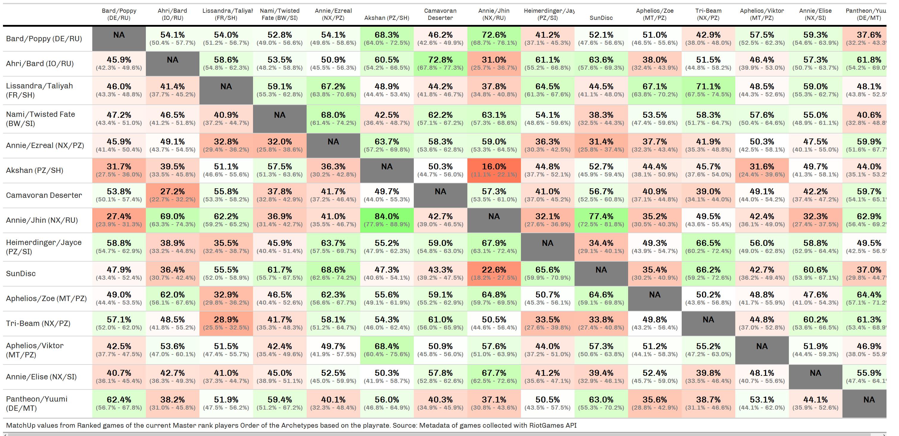
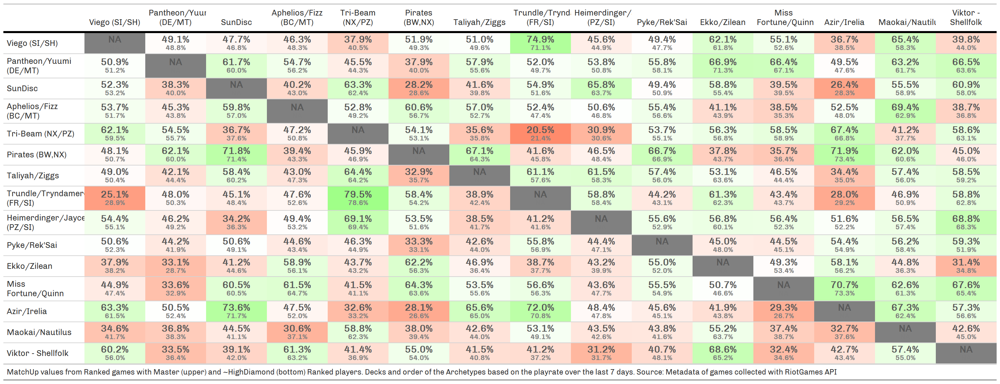

```{r setup, include=FALSE}
knitr::opts_chunk$set(
  echo       = FALSE, 
  eval       = TRUE, 
  warning    = FALSE, 
  error      = FALSE, 
  message    = FALSE, 
  comment    = NA, 
  R.options  = list(width = 140, digits.secs=6), 
  dev.args   = list(bg = 'whitesmoke'), 
  fig.align  = 'center', 
  fig.width  = 12, 
  fig.height = 8, 
  fig.path   = glue::glue("images/"), 
  layout     = "l-page", 
  preview    = TRUE
)

#' R Option
options(scipen = 999)
source(file.path("C:", "LlorR", "scripts", "lor_main.R"))
source(file.path("C:", "LlorR", "scripts", "functions", "lor_constants.R"))
source(file.path("C:", "LlorR", "scripts", "functions", "lor_functions.R"))
xaringanExtra::use_panelset()
```

```{css}
.value-box {
  height: 100px;
}
```

```{r constants}
last_update_box <- flexdashboard::valueBox(
  Sys.Date(), 
  caption = glue::glue("Last Update / Usually done around 5:00 UTC / 7:00 CET"), 
  icon = "fa-clock", 
  color = "#1A9850")
```

```{r load-data}
# load DeckDT
LoR_Deck_RMD       <- fread(file.path("C:", "LlorR", "data", "raw", "LoR_DECK.csv"), na.strings = c("", NA), colClasses = "character")

# load Games DT
LoR_Match_DT_RMD <- list.files(path = file.path("C:", "LlorR", "data", "raw"), pattern = glue("^(.*)Match_DT_{params$last_season}(.*)csv$"), full.names = T) |>
  # str_subset(pattern = "Keys", negate = T) |>
  map_dfr(data.table::fread, header = T, na.strings = c("", NA), encoding = "UTF-8") |>
  mutate(server = if_else(server %in% c("sea","asia"),"apac",server) )

# load Games DT
LoR_Diamond_DT_RMD <- list.files(path = file.path("C:", "LlorR", "data", "raw"), pattern = glue("^(.*)Diamond_DT_{params$last_season}(.*)csv$"), full.names = T) |>
  # str_subset(pattern = "Keys", negate = T) |>
  map_dfr(data.table::fread, header = T, na.strings = c("", NA), encoding = "UTF-8") |>
  mutate(server = if_else(server %in% c("sea","asia"),"apac",server) )
```

```{r deck-fix}
# LoR_Deck_RMD <- archetype_pretty(LoR_Deck_RMD)
LoR_Deck_RMD <- update_and_save_deck(
  LoR_Deck_RMD,
  bind_rows(LoR_Match_DT_RMD, LoR_Diamond_DT_RMD)
  # write = TRUE
)
LoR_Deck_RMD[ !is.na(archetype_pretty), archetype:=archetype_pretty ]
```

Master {data-icon="fa-table"}
================================

```{r prepara-data}
LoR_Melt_Match_RMD <- LoR_Match_DT_RMD |>
  filter(game_type == "Ranked") |>
  filter(str_detect(game_version,"3-10") | game_start_time_utc %within% interval(lubridate::as_datetime(params$start), lubridate::as_datetime(params$end)) ) |>
  melt_match(LoR_Deck_RMD)

LoR_Melt_Diamond_RMD <- LoR_Diamond_DT_RMD |>
  filter(game_type == "Ranked") |>
  filter(str_detect(game_version,"3-10") | game_start_time_utc %within% interval(lubridate::as_datetime(params$start), lubridate::as_datetime(params$end)) ) |>
  melt_match(LoR_Deck_RMD)
```

```{r update-Shiny}
top_archetype <- LoR_Melt_Match_RMD |>
  filter(game_start_time_utc >= Sys.Date()+hours(18)-days(7) ) |>
  count(playerDeck) |>
  slice_max(n, n = 30,with_ties = F ) |>
  pull(playerDeck)

Shiny_MUtbl <- LoR_Melt_Match_RMD |>
  # bind_rows(LoR_Melt_Diamond_RMD) |>
  filter(playerDeck %in% top_archetype & opponentDeck %in% top_archetype) |>
  # match_ups()
  distinct(match_key,playerPuuid,.keep_all = T) |>
  filter(game_outcome!="tie") |>
  group_by(playerDeck,opponentDeck) |>
  summarise(
    muWin   = sum(game_outcome=="win"),
    muGames = n(),
    muWR = mean(game_outcome=="win")
  ) |>
  ungroup() |>
  mutate(playrate = muWin/muGames) |>
  mutate(ci_limit = pmap(list(muWin, muGames), ~ binom::binom.confint(..1, ..2, 0.95, methods = "exact")[5:6])) |>
  unnest(ci_limit, names_repair = "universal") |>
  rename(LCI = lower, UCI = upper) |>
  mutate(
    okCI:=(!between(0.50,LCI,UCI)),
    direction:=ifelse(muWR>0.50,"POS","NEG"),
    CI = glue("({percent(LCI,accuracy = 0.1)} - {percent(UCI,accuracy = 0.1)})" )
  )

tibble::tibble(
  playerDeck   = rep(top_archetype, each= length(top_archetype)),
  opponentDeck = rep(top_archetype, times=length(top_archetype))
) |>
  left_join(Shiny_MUtbl, by = c("playerDeck","opponentDeck")) |>
  fwrite(file.path("C:","LlorR","scripts","shiny","bo3-helper",glue::glue("{params$set_names}-MUtbl.csv")))
```

```{r process-data-master}
WR_tbl <- win_rates(LoR_Melt_Match_RMD, server = F)

MU_tbl <- match_ups(LoR_Melt_Match_RMD,min_games = params$min_mu_games) |>
  mutate(mirror = if_else(playerDeck==opponentDeck, "Yes", "No" ) ) |>
  left_join(WR_tbl |>
              select(playerDeck,playrate), by = "playerDeck") |>
  left_join(WR_tbl |>
              select(playerDeck,opponentPR=playrate), by = c("opponentDeck"="playerDeck")) |>
  select(-lower,-upper)
```

Row
-----------------------------------------------------------------------

### Box MU

```{r}
nGames = MU_tbl |>
  summarise(n = sum(muGames)) |>
  pull()

flexdashboard::valueBox(glue::glue("{NROW(LoR_Melt_Match_RMD)} Master Ranked Games"), 
                        caption = glue::glue("min {params$min_mu_games} games - {nGames} games used"), 
                        icon = "fa-table", 
                        color = "#FA7404") -> master_valuebox

master_valuebox
```

### Last Update

```{r}
last_update_box
```

Inputs {.sidebar}
-----------------------------------------------------------------------

### Filters

```{r filters-master}
crosstalk_data <- crosstalk::SharedData$new(MU_tbl)

crosstalk::filter_select("playerDeck", "Player's Deck",     crosstalk_data, ~playerDeck)
crosstalk::filter_select("opponentDeck", "Opponent's Deck", crosstalk_data, ~opponentDeck)

crosstalk::filter_slider("muWin",   "#Win",                 crosstalk_data, ~muWin,   step = 50 , min = 0)
crosstalk::filter_slider("muGames", "#Games",               crosstalk_data, ~muGames, step = 100, min = 0)

crosstalk::filter_slider("muWR", "WinRate",                 crosstalk_data, ~muWR, step=0.01, min = 0, max = 1)
crosstalk::filter_slider("playrate", "Player PlayRate",     crosstalk_data, ~playrate, step=0.01, min = 0,   max = round(max(MU_tbl$playrate),   4) )
crosstalk::filter_slider("opponentPR", "Opponent PlayRate", crosstalk_data, ~opponentPR, step=0.01, min = 0, max = round(max(MU_tbl$opponentPR), 4) )

crosstalk::filter_select("direction", "MU-Direction",       crosstalk_data, ~direction)
crosstalk::filter_checkbox("mirror", "Mirror",              crosstalk_data, ~mirror, inline = TRUE)
```

Row {data-heigth="750"}
-----------------------------------------------------------------------

### MU table

```{r}
reactable_mu(crosstalk_data)
```

Diamond {data-icon="fa-table"}
================================

```{r process-data-diamond}
WR_diamond <- win_rates(LoR_Melt_Diamond_RMD, server = F)

MU_diamond <- match_ups(LoR_Melt_Diamond_RMD, min_games = params$min_mu_games) |>
  mutate(mirror = if_else(playerDeck==opponentDeck, "Yes", "No" ) ) |>
  left_join(WR_diamond |>
              select(playerDeck,playrate), by = "playerDeck") |>
  left_join(WR_diamond |>
              select(playerDeck,opponentPR=playrate), by = c("opponentDeck"="playerDeck")) |>
  select(-lower,-upper)
```

Row
-----------------------------------------------------------------------

### Box MU

```{r}
nGames_diamond = MU_diamond |>
  summarise(n = sum(muGames)) |>
  pull()

flexdashboard::valueBox(glue::glue("{NROW(LoR_Melt_Diamond_RMD)} Diamond Ranked Games"), 
                        caption = glue::glue("min {params$min_mu_games} games - {nGames_diamond} games used"), 
                        icon = "fa-table", 
                        color = "#FA7404") -> diamond_valuebox

diamond_valuebox
```

### Last Update

```{r}
last_update_box
```

Inputs {.sidebar}
-----------------------------------------------------------------------

### Filters

```{r filters-diamond}
crosstalk_diamond <- crosstalk::SharedData$new(MU_diamond)

crosstalk::filter_select("playerDeck", "Player's Deck",     crosstalk_diamond, ~playerDeck)
crosstalk::filter_select("opponentDeck", "Opponent's Deck", crosstalk_diamond, ~opponentDeck)

crosstalk::filter_slider("muWin",   "#Win",                 crosstalk_diamond, ~muWin,   step = 50 , min = 0)
crosstalk::filter_slider("muGames", "#Games",               crosstalk_diamond, ~muGames, step = 100, min = 0)

crosstalk::filter_slider("muWR", "WinRate",                 crosstalk_diamond, ~muWR, step=0.01, min = 0, max = 1)
crosstalk::filter_slider("playrate", "Player PlayRate",     crosstalk_diamond, ~playrate,   step=0.01, min = 0, max = round(max(MU_diamond$playrate),   4) )
crosstalk::filter_slider("opponentPR", "Opponent PlayRate", crosstalk_diamond, ~opponentPR, step=0.01, min = 0, max = round(max(MU_diamond$opponentPR), 4) )

crosstalk::filter_select("direction", "MU-Direction",       crosstalk_diamond, ~direction)
crosstalk::filter_checkbox("mirror", "Mirror",              crosstalk_diamond, ~mirror, inline = TRUE)
```

Row {data-heigth="750"}
-----------------------------------------------------------------------

### MU table

```{r}
reactable_mu(crosstalk_diamond)
```

Grid {data-icon="fa-file-image"}
================================

Row
-----------------------------------------------------------------------

### Box1 MU

```{r}
master_valuebox
```

### Box2 MU

```{r}
diamond_valuebox
```

### Last Update

```{r}
last_update_box
```

Row {data-heigth="850" .tabset}
-----------------------------------------------------------------------

### MU Grid

```{r print-grid}
grid_source_note <- md(glue::glue("MatchUp values from Ranked games of the current Master rank players
                                  Order of the Archetypes based on the playrate.
                                  WR<sub>meta</inf> defined as the win-rate against decks with at least 1% playrate.
                                  Source: Metadata of games collected with RiotGames API") )


gtMU_grid <- mu_grid(mu_data = MU_tbl, dim_grid = params$dim_grid, 
                     games_data = LoR_Melt_Match_RMD, prev_days = 7, 
                     grid_source_note = grid_source_note, div_1 = 12, div_2 = 12, font_upper = 14, font_lower = 10)


gtMU_grid <- gtMU_grid |>
  tab_options(
    data_row.padding = px(8),
    table.font.size = px(13),
    column_labels.font.size = px(10)
  ) |>
  cols_width(
    -1 ~ px(90),
    1 ~ px(150),
  )

gtMU_grid

gtsave(data = gtMU_grid, glue::glue("images/{params$grid_name}.png"), vwidth = 1500, vheight = 1000) |> invisible()
gtsave(data = gtMU_grid, "images/mugrid.png",     vwidth = 1500, vheight = 1000) |> invisible()
```

### MU Grid - Diamond

```{r}
grid_source_note <- md(glue::glue("MatchUp values from Ranked games of the current HighDiamond rank players players who played against Master players but are not Master themselves
                                  Order of the Archetypes based on the playrate.
                                  WR<sub>meta</inf> defined as the win-rate against decks with at least 1% playrate.
                                  Source: Metadata of games collected with RiotGames API") )


gtMU_grid <- mu_grid(mu_data = MU_diamond, dim_grid = params$dim_grid, 
                     games_data = LoR_Melt_Diamond_RMD, prev_days = 7, 
                     grid_source_note = grid_source_note, div_1 = 12, div_2 = 12, font_upper = 14, font_lower = 10)


gtMU_grid <- gtMU_grid |>
  tab_options(
    data_row.padding = px(8),
    table.font.size = px(13),
    column_labels.font.size = px(10)
  ) |>
  cols_width(
    -1 ~ px(90),
    1 ~ px(150),
  )

gtMU_grid

gtsave(data = gtMU_grid, glue::glue("images/{params$grid_name}_diamond.png"), vwidth = 1500, vheight = 1000) |> invisible()
```

Grid Older Patch  {data-icon="fa-file-image"}
================================

Row {.tabset}
-----------------------------------------------------------------------

### Patch 3.11 - Patch 3.12


### Patch 3.10 - WorlWalker


### Patch 3.8 - Patch 3.9



### Patch 3.6 - Patch 3.7



### Patch 3.4 - Patch 3.5


Downloads and Informations {data-orientation="columns" data-icon="fa-info-circle"}
================================

Download {data-width="250"}
-----------------------------------------------------------------------

### Match Ups Data

```{r download-master}
MU_tbl |>
  # filter(muGames >= params$min_mu_games) |>
  select(playerDeck, opponentDeck, muWin, muGames, muWR) |>
  downloadthis::download_this(
    button_label = glue("Download MU (Master) data as .csv
                        min {params$min_mu_games} games"), 
    output_name = "mutable", 
    button_type = "success", 
    has_icon = TRUE, 
    icon = "fa fa-save")

# MU_tbl |>
#   select(playerDeck, opponentDeck, muWin, muGames, muWR) |>
#   jsonlite::write_json("MU.json")
```

### Match Ups Grid

```{r}
downloadthis::download_file(
  path = file.path("images/mugrid.png"), 
  # path = system.file("assets/css/all.min.css", package = "downloadthis"), 
  button_label = "Download MU grid as .png", 
  button_type = "primary", 
  has_icon = TRUE, 
  icon = "fa fa-save", 
  self_contained = FALSE
)
```

Column {data-width="750"}
-----------------------------------------------------------------------

### How to use

#### Filters

The format of the table is the usual way I display the match-ups data but I also displayed additional variables that I normally remove in the report:

-   **Player's Deck** - deck's archetype of the playerDeck

-   **Opponent's Deck** - deck's archetype of the opponentDeck

-   **#Win** - min number of wins for a match-up

-   **#Games** - min number of games for a match-up

-   **Regions** - regions of the 'Player' deck.

-   **MU-Direction** - simply if the MU is positive (win rate > 50%) or negative (win rate \< 50%) for the 'Player' or tie (win rate = 50%)

-   **Mirror** - hide or include mirror match-ups

#### Archetypes Fix

```{r}
tbl_archetype

gt::gtsave(data = tbl_archetype, glue::glue("images/archetype_guide.png")) |> invisible()
```

#### General info

When I refer to games it's always refering a single playerDeck. So, if I have the information of 1 match it's equivalent to 2 games.

#### Credits

<!-- Special thanks to Trinathan and bA1ance for the recent support (ᐛ)ᕗ  -->
