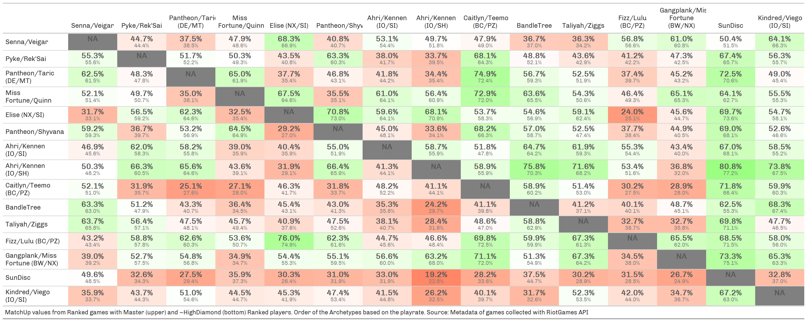

```{r setup, include=FALSE}
knitr::opts_chunk$set(
  echo       = FALSE,
  eval       = TRUE,
  warning    = FALSE,
  error      = FALSE,
  message    = FALSE,
  comment    = NA,
  R.options  = list(width = 140, digits.secs=6),
  dev.args   = list(bg = 'whitesmoke'),
  fig.align  = 'center',
  fig.width  = 12,
  fig.height = 8,
  fig.path   = glue::glue("images/"),
  layout     = "l-page",
  preview    = TRUE
)

#' R Option
options(scipen = 999)
source(file.path("C:","LlorR","scripts","lor_main.R"))
source(file.path("C:","LlorR","scripts","functions","lor_constants.R"))
source(file.path("C:","LlorR","scripts","functions","lor_functions.R"))
xaringanExtra::use_panelset()
```

```{r load-data}
# load DeckDT
LoR.Deck.RMD       <- fread(file.path("C:","LlorR","data","raw","LoR_DECK.csv"),na.strings = c("",NA))

# load Games DT
LoR.Match.DT.RMD <- list.files(path = file.path("C:", "LlorR", "data", "raw"), pattern = glue("^(.*)Temp_DT_S12(.*)csv$"), full.names = T) |>
  str_subset(pattern = "Keys",negate = T) |>
  map_dfr(data.table::fread,header = T, na.strings = c("", NA), encoding = "UTF-8") |>
  # map(data.table::fread) |>
  # reduce(rbind) |>
  mutate(server = if_else(server %in% c("sea","asia"),"apac",server) ) |>
  select(-contains("factions"))
```

```{r constants}
LastUpdate.box <- flexdashboard::valueBox(
  Sys.Date(),
  caption = glue::glue("Last Update / Usually done around 5:00 UTC / 7:00 CET"),
  icon = "fa-clock",
  color = "#1A9850")
```

```{r archetype-fix}
source(file.path("C:","LlorR","scripts","functions","lor_archetype_rmd.R"))
LoR.Deck.RMD[ !is.na(archetype_pretty), archetype:=archetype_pretty ]
```

# Seasonal Players {data-icon="fa-table"}

```{r prepara-data}
LoR.Melt.Master.RMD <- LoR.Match.DT.RMD |>
  filter(game_type == "Ranked"  ) |>
  filter(game_start_time_utc %within% interval(as.POSIXct(params$start,"UTC"),as.POSIXct(params$end,"UTC")) ) |>
  rename(playerPuuid_1 = puuid_1, playerPuuid_2 = puuid_2 ) |>
  mutate(opponentPuuid_1 = playerPuuid_2, opponentPuuid_2 = playerPuuid_1 ) |>
  mutate(opponent_deck_code_1 = deck_code_2, opponent_deck_code_2 = deck_code_1 ) |>
  pivot_longer(
    cols = c(ends_with("_1"),ends_with("_2")),
    names_to = c(".value"),
    names_pattern = "(.*)_[0-9]"
    ) |>
  as.data.table() |>
  left_join(LoR.Deck.RMD, by="deck_code") |>
  rename(playerDeck=archetype) |>
  left_join(
    LoR.Deck.RMD[,.(deck_code,opponentDeck=archetype)],
    by=c("opponent_deck_code"="deck_code"))
```

```{r process-MU-seasonal}
# WR tbl
WR.DT <- LoR.Melt.Master.RMD |>
  filter(game_outcome!="tie") |>
  select( playerDeck,opponentDeck,game_outcome) |>
  group_by(playerDeck) |>
  summarise( 
    nWin   = sum(game_outcome=="win"),
    nGames = n(),
    WR=mean(game_outcome=="win")
  ) |>
  ungroup() |>
  mutate(playrate = nGames/sum(nGames) ) |>
  as.data.table()

MUtbl <- LoR.Melt.Master.RMD |>
  filter(game_outcome != "tie" ) |>
  select(playerDeck,opponentDeck,game_outcome,server) |>
  group_by(playerDeck,opponentDeck) |>
  summarise( 
    muWin   = sum(game_outcome=="win"),
    muGames = n(),
    muWR=mean(game_outcome=="win")
    # factions = unique(factions)
    ) |>
  ungroup() |>
  filter(muGames >= params$minMUGames) |>
  mutate(CI=map2_df(.x=muWin,.y = muGames, .f = ~binom::binom.confint(.x,.y,0.95,methods="exact")[,c("lower","upper")] )) |>
  chop(CI) |>
  unnest(CI) |>
  mutate( 
    okCI = map2_lgl(.x = lower,.y = upper, ~ !between(0.50,.x,.y) ) ,
    direction = ifelse(muWR>0.50,"POS","NEG"),
    direction = replace(direction,direction==0.50,"TIE"),
    CI := glue::glue("({scales::percent(lower,accuracy = 0.1)}-{scales::percent(upper,accuracy = 0.1)})" ),
    mirror = ifelse(playerDeck==opponentDeck,"Yes","No" )
    ) |>
  # removing ~extra variables
  select(-lower,-upper) |>
  left_join(WR.DT[,.(playerDeck,playrate)],by="playerDeck") |>
  left_join(WR.DT[,.(playerDeck,opponentPR=playrate)],by=c("opponentDeck"="playerDeck") )
```

## Inputs {.sidebar}

### Filters

```{r filters}
data <- crosstalk::SharedData$new( MUtbl )

crosstalk::filter_select("playerDeck", "Player's Deck", data, ~playerDeck)
crosstalk::filter_select("opponentDeck", "Opponent's Deck", data, ~opponentDeck)

crosstalk::filter_slider("muWin",   "#Win",  data, ~muWin,   step = 50 ,min = 0)
crosstalk::filter_slider("muGames", "#Games",data, ~muGames, step = 100,min = 0)

crosstalk::filter_slider("muWR", "WinRate", data, ~muWR,step=0.01,min = 0,max = 1)
crosstalk::filter_slider("playrate", "Player PlayRate", data, ~playrate,step=0.01,min = 0,max = round(max(MUtbl$playrate),4) )
crosstalk::filter_slider("opponentPR", "Opponent PlayRate", data, ~opponentPR,step=0.01,min = 0,max = round(max(MUtbl$opponentPR),4) )

crosstalk::filter_select("direction", "MU-Direction", data, ~direction)
crosstalk::filter_checkbox("mirror", "Mirror", data, ~mirror, inline = TRUE)
```

## Row {data-heigth="750"}

### MU table

```{r print-react-MU}
data |>
  reactable(
    bordered = TRUE,
    highlight = TRUE,
    striped = TRUE,
    searchable = TRUE,
    compact = TRUE, # compact the table height
    fullWidth = T, # don't fill the page
    defaultPageSize = 20,
    wrap = TRUE,
    defaultSorted = list(muGames = "desc"),
    # filterable = TRUE,
    defaultColDef = colDef(
      style = list(fontFamily = "Roboto", fontSize = "13px"), align = "center"
      # minWidth = 120,
      ),
    columns = list(
      playerDeck   = colDef(name = "Player",minWidth = 120, style = list(fontSize = "11px", fontWeight = "bold", color="black") ),
      opponentDeck = colDef(name = "Opponent"  ,minWidth = 120, style = list(fontSize = "11px", fontWeight = "bold", color="black")),
      muWin    = colDef(name = "#Win" ), # , style = list( fontSize = "13px")
      muGames  = colDef(name = "#Games",defaultSortOrder = "desc"),
      muWR  = colDef(
        name = "Win Rate",
        # defaultSortOrder = "desc",
        cell = function(value) {
          label <- paste0(round(value * 100,1), "%")
          bar_chart_pos_neg(label, value)
          },
        align = "center",
        minWidth = 200
        ),
      playrate = colDef(name = "Player PlayRate",format = colFormat(percent = TRUE,digits = 1), style = list( fontSize = "13px") ),
      # factions = colDef(name = "Regions"),
      CI       = colDef(name = "CI",minWidth = 120, style = list(fontSize = "13px")),
      LCI       = colDef(show=F), # lower
      UCI       = colDef(show=F), # lower
      direction = colDef(show=F),
      okCI      = colDef(show=F),
      mirror    = colDef(show=F),
      opponentPR = colDef(name = "Opponent PlayRate",format = colFormat(percent = TRUE,digits = 1), style = list( fontSize = "13px") )
      )
    )
```

## Row

### Box MU

```{r}
nGames = MUtbl |> 
  # filter( muGames > params$minMUGames ) |>
  summarise(n = sum(muGames)) |>
  pull()

flexdashboard::valueBox(glue::glue("{nGames} Ranked Games"),
                        caption = glue::glue("out of a total of {NROW(LoR.Melt.Master.RMD)} - min {params$minMUGames} games"),
                        icon = "fa-table",
                        color = "#FA7404")
```

### Last Update

```{r last-update}
LastUpdate.box
```

# Grid {data-icon="fa-file-image"}

## Row {data-heigth="850"}

### MU Grid

```{r create-mu-tbl}
# Last 7 days most played
TopCC <- LoR.Melt.Master.RMD |>
  filter( game_start_time_utc >= now()-days(7) ) |>
  count(playerDeck) |>
  slice_max(n, n = params$nGrid,with_ties = F ) |> 
  pull(playerDeck)

MUtbl.Master <- tibble::tibble( 
  playerDeck = rep(TopCC,each=params$nGrid),
  opponentDeck = rep(TopCC,params$nGrid)
  ) |> 
  left_join( MUtbl, by = c("playerDeck","opponentDeck")) |>
  mutate( muWR = replace(muWR, muGames < params$minMUGames, NA ) )

grid <- matrix(MUtbl.Master$muWR,
               nrow = params$nGrid,
               ncol = params$nGrid, byrow = T)

diag(grid) <- NA
colnames(grid) <- TopCC
```

```{r gt-grid}
MU.grid.gt <- grid |>
  as.data.table() |>
  add_column(name = colnames(grid),.before = 1 ) |>
  rename(" "=1) |>
  gt() |>
  gtExtras::gt_color_rows(2:(params$nGrid+1),
                # palette = c("#D73027", "white", "#1A9850" ),
                palette = c("red", "white", "green"),
                use_paletteer = F,
                domain = c(0,1) ) |>
  fmt_percent(
    columns = -1,
    decimals = 1
  ) |>
# MUgrid.gt.final <- MUgrid.gt |>
  cols_align(
    align = "center",
    columns = -1
  ) |>
  tab_options(
    data_row.padding = px(3.5),
    table.font.size = px(12)
  ) |>
  cols_width(
    -1 ~ px(90),
     1 ~ px(120),
    # everything() ~ px(90)
  ) |>
  opt_table_font(
    font = "Chivo"
  ) |>
  tab_style(
    style = list(
      cell_borders(
        sides = "bottom",
        color = "black",
        weight = px(3)
      )
    ),
    locations = list(
      cells_column_labels(
        columns = gt::everything()
      )
    )
  ) |>
  text_transform(
      locations = cells_body(
        columns = -1
        ),
      fn = function(x){
        glue::glue("<div style='line-height:12px'><span style='font-weight:bold;color:#595959;font-variant:small-caps;font-size:14px'>{x}</div>")
      }
    ) |>
  tab_source_note(
  source_note = md(glue::glue("MatchUp values from Ranked games of Magic Disadventure Seasonal Tournament players
                              Order of the Archetypes based on the playrate.
                              Source: Metadata of games collected with RiotGames API")
  ))

MU.grid.gt |>
  tab_options(
    data_row.padding = px(8),
    table.font.size = px(13),
    column_labels.font.size = px(10)
  ) |>
  cols_width(
    -1 ~ px(90),
     1 ~ px(150),
  ) 
  
gtsave(data = MU.grid.gt,"images/mugrid_302.png",vwidth = 1500, vheight = 1000) |> invisible()
gtsave(data = MU.grid.gt,"images/mugrid.png",vwidth = 1500, vheight = 1000) |> invisible()
```

## Row

### Box MU

```{r}
flexdashboard::valueBox(glue::glue("{nGames} Ranked Games - Seasonal Players"),
                        caption = glue::glue("out of a total of {NROW(LoR.Melt.Master.RMD)} - min 10 games"),
                        icon = "fa-table",
                        color = "#FA7404")
```

### Last Update

```{r}
LastUpdate.box
```


```{r}
# knitr::include_graphics(path = "./images/mugrid.png")
```

# Grid 3.00/3.01 (Magic Disadventure) {data-icon="fa-file-image"}



# Downloads and Informations {data-orientation="columns" data-icon="fa-info-circle"}

## Download {data-width="250"}

### Match Ups Data

```{r download-master}
MUtbl |>
  filter(muGames >= params$minMUGames) |>
  select(playerDeck,opponentDeck,muWin,muGames,muWR) |>
  downloadthis::download_this(
    button_label = glue("Download MU (Master) data as .csv
                        min {params$minMUGames} games"),
    output_name = "mutable",
    button_type = "success",
    has_icon = TRUE,
    icon = "fa fa-save")

# MUtbl |>
#   select(playerDeck,opponentDeck,muWin,muGames,muWR) |>
#   jsonlite::write_json("MU.json")
```

### Match Ups Grid

```{r}
downloadthis::download_file(
  path = file.path("images/mugrid.png"),
  # path = system.file("assets/css/all.min.css", package = "downloadthis"),
  button_label = "Download MU grid as .png",
  button_type = "primary",
  has_icon = TRUE,
  icon = "fa fa-save",
  self_contained = FALSE
)
```

## Column {data-width="750"}

### How to use

#### Filters

The format of the table is the usual way I display the match-ups data but I also displayed additional variables that I normally remove in the report:

-   **Player's Deck** - deck's archetype of the playerDeck

-   **Opponent's Deck** - deck's archetype of the opponentDeck

-   **#Win** - min number of wins for a match-up

-   **#Games** - min number of games for a match-up

-   **Regions** - regions of the 'Player' deck.

-   **MU-Direction** - simply if the MU is positive (win rate > 50%) or negative (win rate \< 50%) for the 'Player' or tie (win rate = 50%)

-   **Mirror** - hide or include mirror match-ups

#### Archetypes Fix

```{r gt-archetype}
source(file.path("C:","LlorR","scripts","functions","lor_archetype_gt.R"))
gtfix
```

#### General info

When I refer to games it's always refering a single playerDeck. So, if I have the information of 1 match it's equivalent to 2 games.

#### Credits

Special thanks to Trinathan and bA1ance for the recent support (ᐛ)ᕗ 

```{r update-Shiny}
# TopCC <- LoR.Melt.Master.RMD |>
#   count(playerDeck) |>
#   slice_max(n, n = 30,with_ties = F ) |> 
#   pull(playerDeck)
# 
# MUtbl <- LoR.Melt.Master.RMD |>
#   bind_rows(LoR.Melt.Diamond.RMD) |>
#   filter(playerDeck %in% TopCC & opponentDeck %in% TopCC) |>
#   # removing the first week to remove "noise"
#   filter(game_start_time_utc %within% interval(as.POSIXct(params$start,"UTC")+days(7),as.POSIXct(params$end,"UTC")) ) |>
#   distinct(match_key,playerPuuid,.keep_all = T) |>
#   filter(game_outcome!="tie") |>
#   group_by(playerDeck,opponentDeck) |>
#   summarise(muWin   = sum(game_outcome=="win"),
#             muGames = n(),
#             muWR=mean(game_outcome=="win") ) |>
#   ungroup() |>
#   mutate(playrate = muWin/muGames) |>
#   as.data.table() |>
#   {\(x) x[ ,c("LCI","UCI") := binom.confint(muWin,muGames,0.95,methods="exact")[5:6] ] }() |>
#   mutate( 
#     okCI:=(!between(0.50,LCI,UCI)),
#     direction:=ifelse(muWR>0.50,"POS","NEG"),
#     CI = glue("({percent(LCI,accuracy = 0.1)} - {percent(UCI,accuracy = 0.1)})" ) )
# 
# tibble::tibble( 
#   playerDeck = rep(TopCC,each=30),
#   opponentDeck = rep(TopCC,30)
#   ) |> 
#   left_join( MUtbl, by = c("playerDeck","opponentDeck")) |>
#   # mutate( muWR = replace(muWR, muGames < params$minMUGames, NA ) ) |>
#   fwrite(file.path("C:","LlorR","scripts","shiny","bo3-helper","Bandle02-MUtbl.csv"))
```
